# Installation Guide of RoboticBase Core (Microsoft Azure AKS)

## Requirements

||version|
|:--|:--|
|OS|macOS Mojave 10.14.6<br/>Ubuntu 16.04|
|pyenv|1.2.16|
|pipenv|2018.11.26|
|kubectl|1.17.3|
|helm|3.1.1|
|openssl|2.6.5|
|azure cli|2.1.0|

## Preparation
### Install tools
<details><summary>Install <b>pyenv</b> and <b>pipenv</b></summary>
<p>

#### macOS

```
$ brew install pyenv
$ echo 'export PYENV_ROOT="$HOME/.pyenv"' >> ~/.bashrc
$ echo 'export PATH="$PYENV_ROOT/bin:$PATH"' >> ~/.bashrc
$ echo 'eval "$(pyenv init -)"' >> ~/.bashrc
$ source ~/.bashrc
$ brew install pipenv
```

#### ubuntu

```
$ sudo apt install -y build-essential libffi-dev libssl-dev zlib1g-dev libbz2-dev libreadline-dev libsqlite3-dev git python3-pip
$ git clone https://github.com/pyenv/pyenv.git ~/.pyenv
$ echo 'export PYENV_ROOT="$HOME/.pyenv"' >> ~/.bashrc
$ echo 'export PATH="$PYENV_ROOT/bin:$PATH"' >> ~/.bashrc
$ echo 'eval "$(pyenv init -)"' >> ~/.bashrc
$ source ~/.bashrc
$ pip3 install pipenv
```

</p>
</details>

<details><summary>Install <b>kubectl</b></summary>
<p>

#### macOS

```
$ curl -LO "https://storage.googleapis.com/kubernetes-release/release/v1.17.3/bin/darwin/amd64/kubectl"
$ chmod +x ./kubectl
$ sudo mv ./kubectl /usr/local/bin/kubectl
```

#### ubuntu

```
$ curl -LO "https://storage.googleapis.com/kubernetes-release/release/v1.17.3/bin/linux/amd64/kubectl"
$ chmod +x ./kubectl
$ sudo mv ./kubectl /usr/local/bin/kubectl
```

</p>
</details>

<details><summary>Install <b>helm</b></summary>
<p>

#### macOS

```
$ curl -LO "https://get.helm.sh/helm-v3.1.1-darwin-amd64.tar.gz"
$ tar xvfz helm-v3.1.1-darwin-amd64.tar.gz
$ sudo mv darwin-amd64/helm /usr/local/bin/helm
```

#### ubuntu

```
$ curl -LO "https://get.helm.sh/helm-v3.1.1-linux-amd64.tar.gz"
$ tar xvfz helm-v3.1.1-linux-amd64.tar.gz
$ sudo mv linux-amd64/helm /usr/local/bin/helm
```

</p>
</details>

<details><summary>Install <b>openssl</b></summary>
<p>

#### macOS

```
$ brew install openssl
```

#### ubuntu

```
$ sudo apt install -y openssl
```

</p>
</details>

<details><summary>Install <b>Azure CLI</b></summary>
<p>

#### macOS

```
$ brew install azure-cli
```

#### ubuntu

```
$ curl -sL https://aka.ms/InstallAzureCLIDeb | sudo bash
```

</p>
</details>

### Prepare ansible
<details><summary>Clone RoboticBase/core</summary>
<p>

```
$ git clone https://github.com/RoboticBase/core.git
$ cd core
```

</p>
</details>

<details><summary>Install <b>ansible</b> and related libraries</summary>
<p>

```
$ cd ansible
$ pipenv install
```

</p>
</details>

## Installation of RoboticBase/core
### Set your variables (mandatory)
1. Set the password of MQTT user (`iotagent`) in the following yaml file:
    * [group\_vars/all.yml](../../ansible/group_vars/all.yml)
        * target: ```mqtt.users[?name==`iotagent`].password```
1. Change the domain name defined in the following yaml file to your own domain:
    * [inventories/aks/group\_vars/aks.yml](../../ansible/inventories/aks/group_vars/aks.yml)
        * target: ```dns.domain```
1. Change the email address defined in the following yaml file to your own email:
    * [inventories/aks/group\_vars/aks.yml](../../ansible/inventories/aks/group_vars/aks.yml)
        * target: ```dns.email```
1. Change the SSH key path defined in the following yaml file to your own public key:
    * [inventories/aks/host\_vars/azure.yml](../../ansible/inventories/aks/host_vars/azure.yml)
        * target: ```resources.ssh_key_file_path```

### Update your variables (optional)
1. If necessary, update the variables in the following yaml file such as the number of worker nodes or the size of VM:
    * [inventories/aks/group\_vars/aks.yml](../../ansible/inventories/aks/group_vars/aks.yml)
1. If necessary, update the variables in the following yaml file such as the number of pod replicas:
    * [inventories/aks/group\_vars/aks.yml](../../ansible/inventories/aks/group_vars/aks.yml)

### Generate Azure Credentials
1. Generate Azure Credentials which are used to operate Azure from ansible by executing following shell script:

    ```
    $ ./tools/generate_azure_credentials.sh
    ```

### Start RoboticBase/core
1. Start "pipenv shell"

    ```
    $ pipenv shell
    ```
1. Start RoboticBase/core on Azure AKS using ansible

    ```
    $ ansible-playbook -i inventories/aks --extra-vars="ansible_python_interpreter=$(which python)" aks.yml
    ```
1. After starting ansible-playbook, you will be prompted to log in Azure
    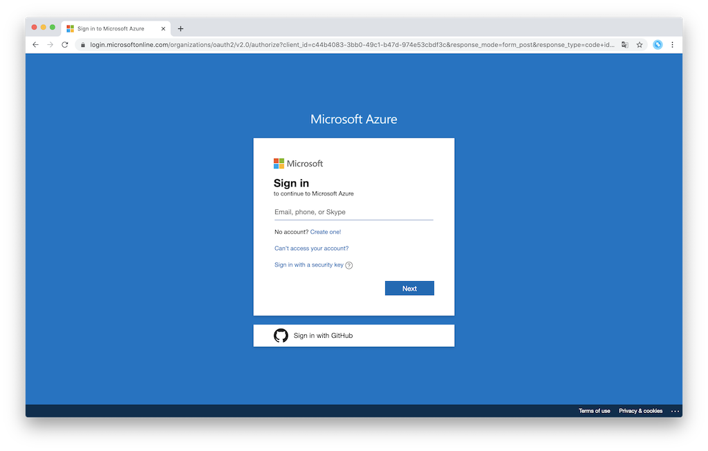

### Configure grafana
1. Access grafana (`https://grafana.{{ your domain }}`)
    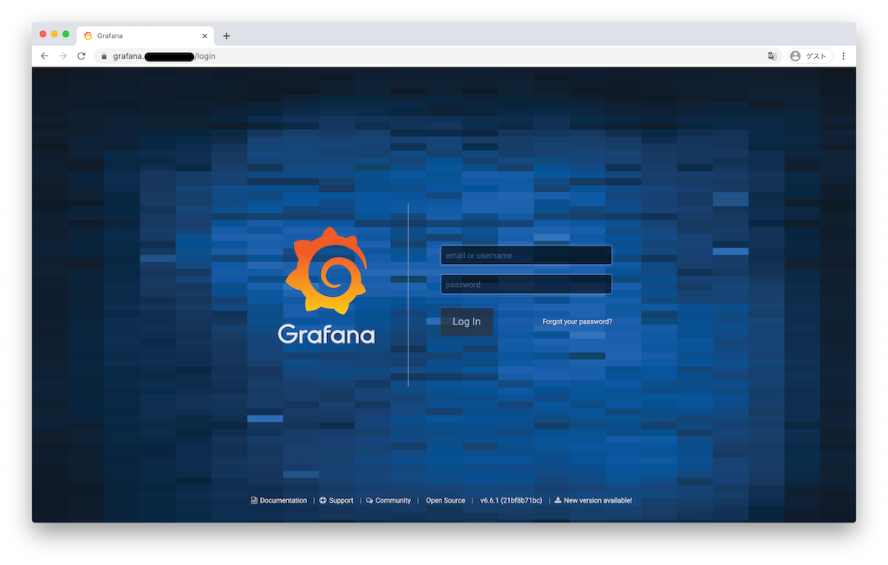
1. Input "admin" to **email or username** and "prom-operator" to **password**, and push **Log In**
    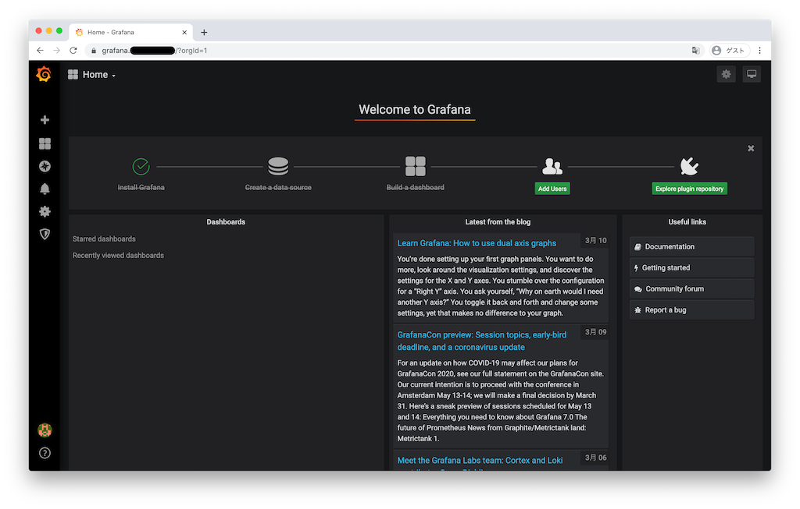
1. Select **Change Password** from **Preferences**, and change the password of admin
    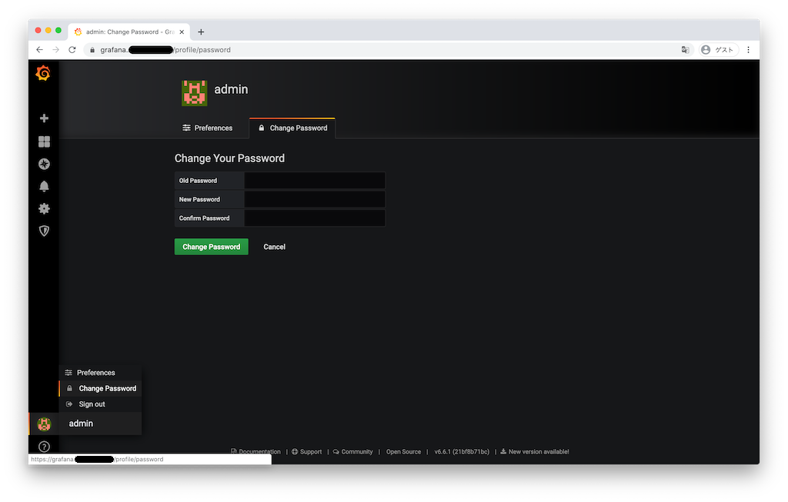
1. Confirm the dashboards which were installed for monitoring the resources of Azure AKS
    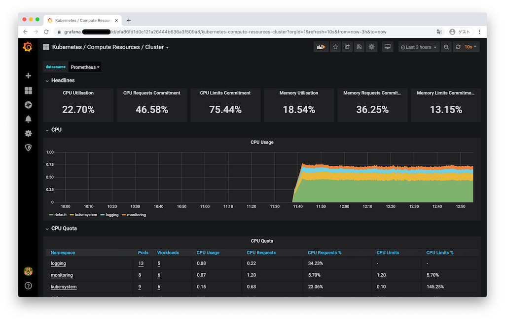

### Configure kibana
1. Confirm the username and password of kibana

    ```
    $ ./tools/show_kibana_credentials.py
    ```
1. Access kibana (`https://kibana.{{ your domain }}`)
    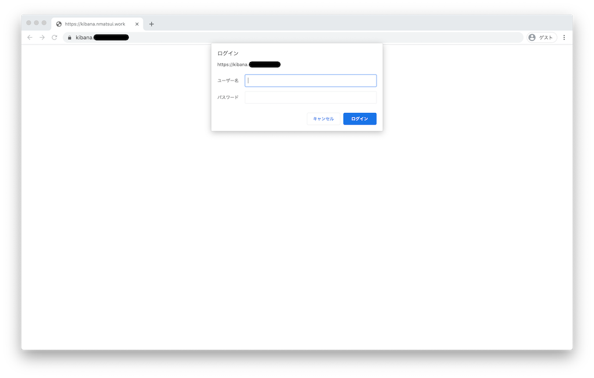
1. Input the username and password of kibana, and Log in kibana
    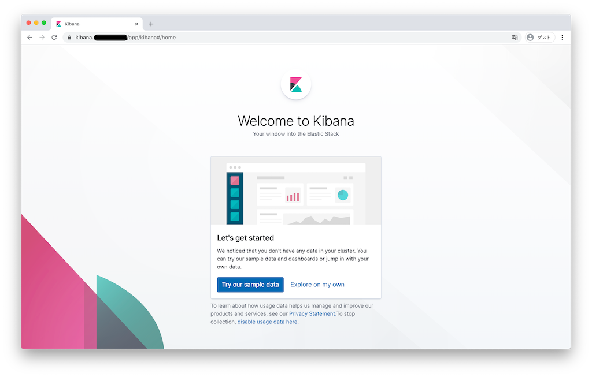
1. Show *Home* view by clicking **Explore on my own**
    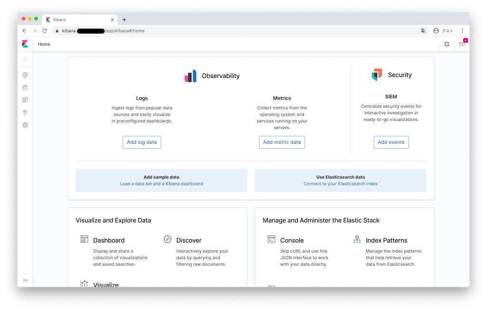
1. Show *Management* view by clicking **Management**
    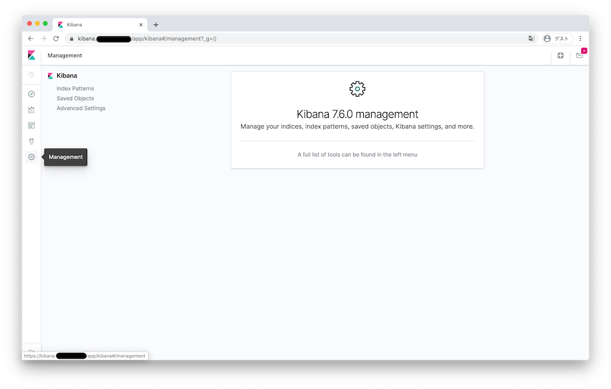
1. Click **Index Patterns**
    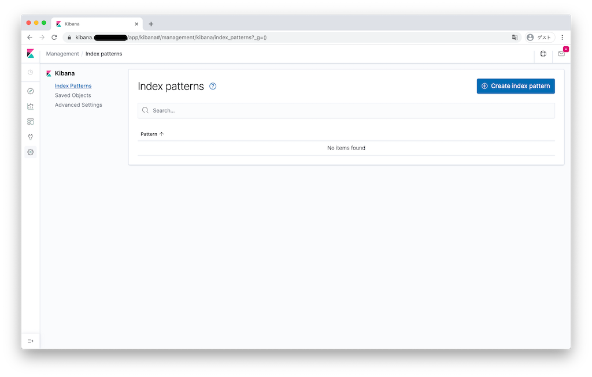
1. Click **Create Index Patterns**
    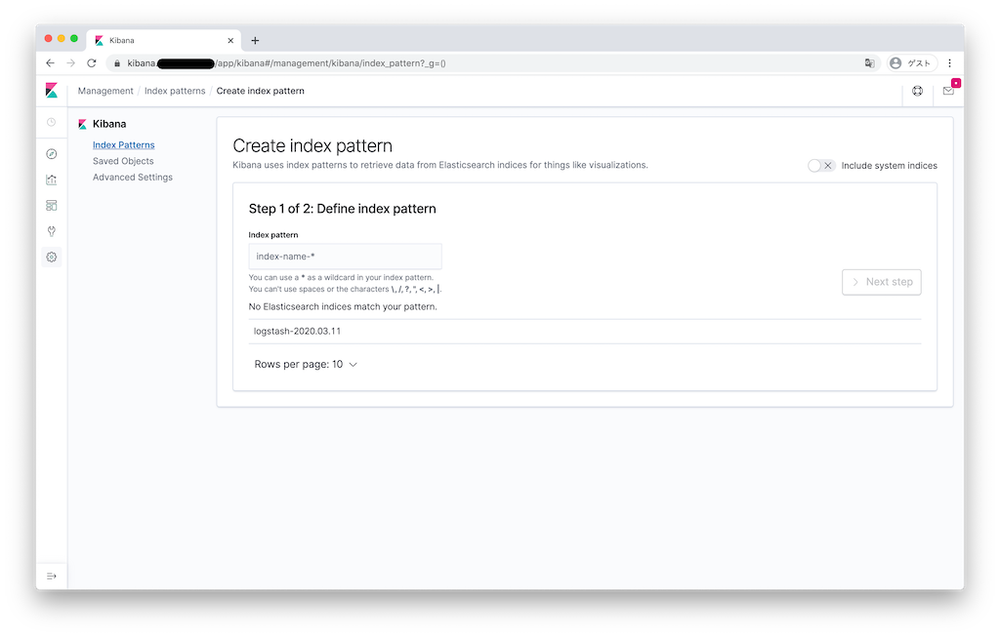
1. Input "logstash-\*" to **Index pattern**, and click **Next Step**
    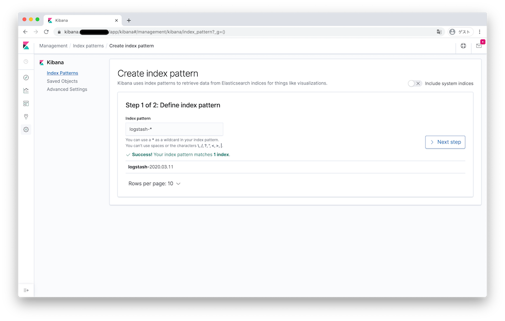
1. Select "@timestamp" at **Time Filter field name**, click **Create Index pattern**
    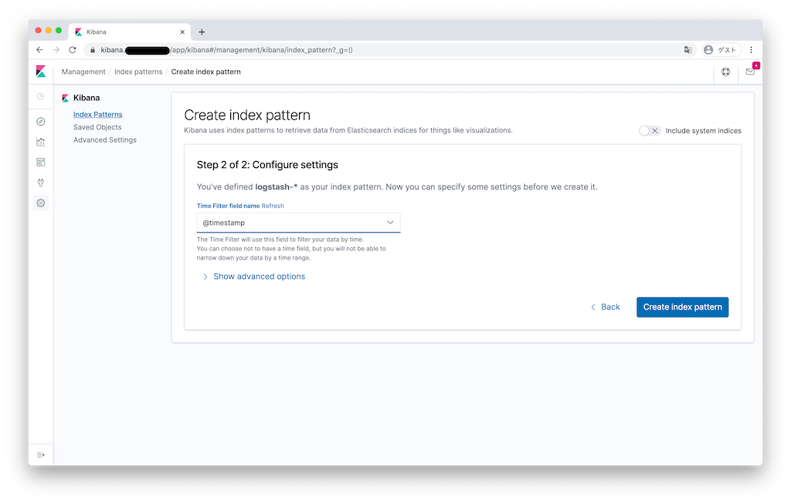
1. The Index of log messages is created automatically
    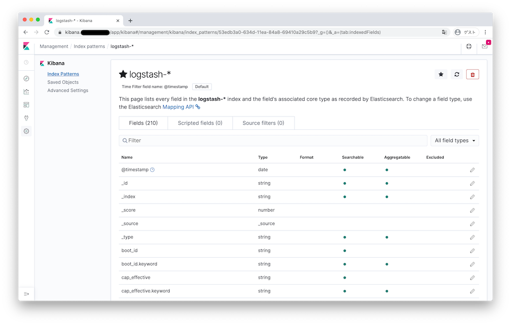
1. Click **Discover**, and confirm the log messages gathered from Pods
    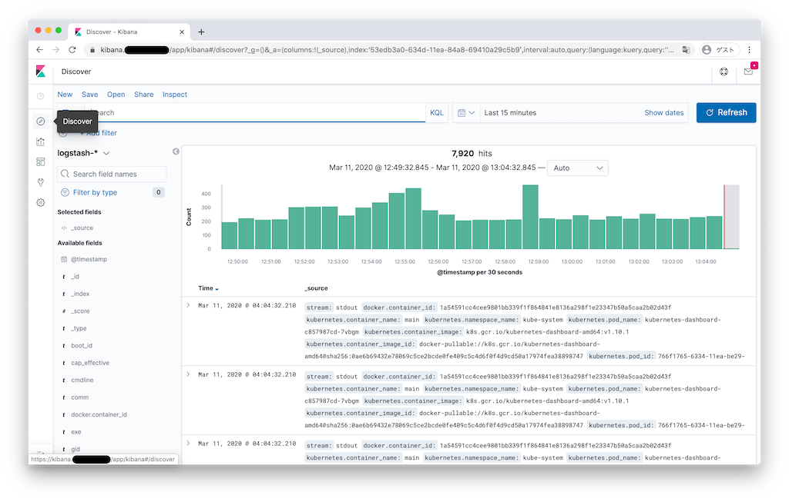
