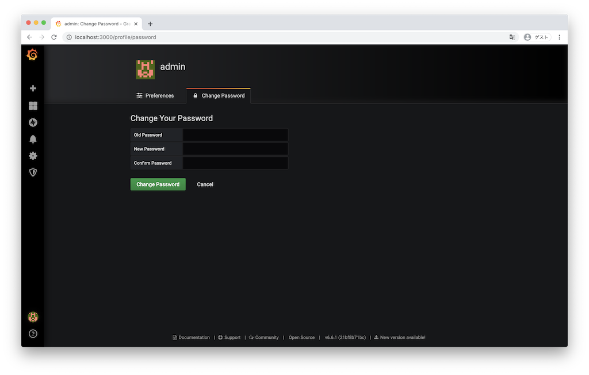
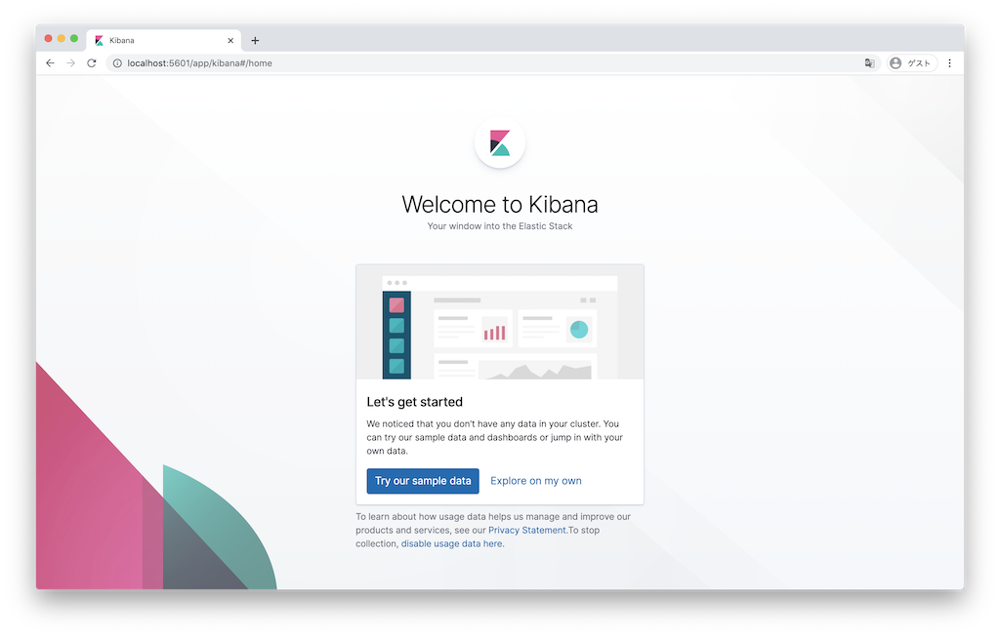
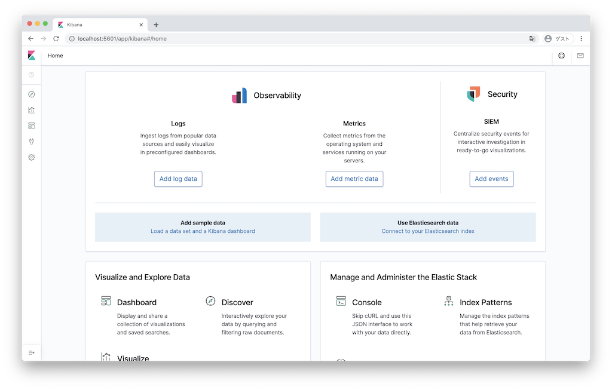
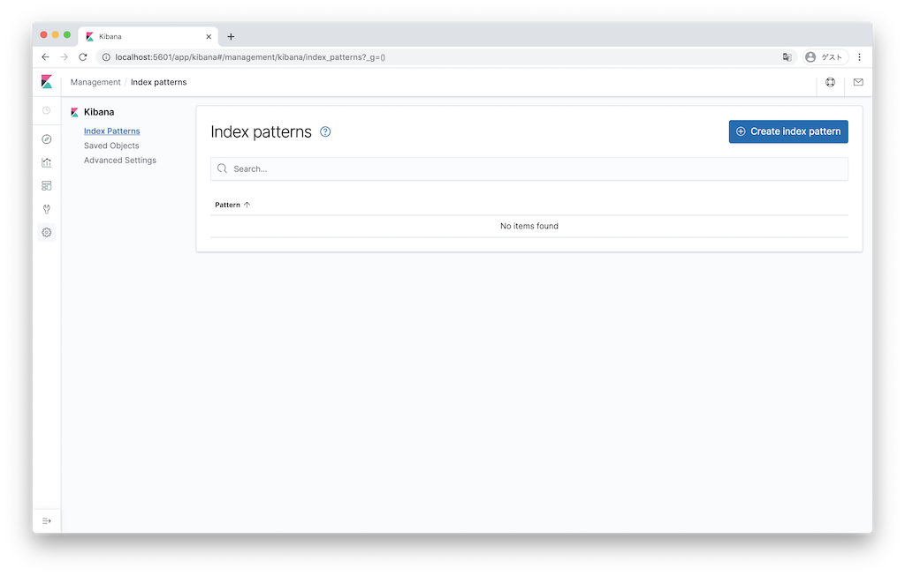

# Installation Guide of RoboticBase Core (minikube)

## Requirements

||version|
|:--|:--|
|OS|macOS Mojave 10.14.6<br/>Ubuntu 16.04|
|pyenv|1.2.16|
|pipenv|2018.11.26|
|kubectl|1.17.3|
|helm|3.1.1|
|VirtualBox|6.1.2 r135662|
|minikube|1.7.3|

## Preparation
### Install tools
<details><summary>Install <b>pyenv</b> and <b>pipenv</b></summary>
<p>

#### macOS

```
$ brew install pyenv
$ echo 'export PYENV_ROOT="$HOME/.pyenv"' >> ~/.bashrc
$ echo 'export PATH="$PYENV_ROOT/bin:$PATH"' >> ~/.bashrc
$ echo 'eval "$(pyenv init -)"' >> ~/.bashrc
$ source ~/.bashrc
$ brew install pipenv
```

#### ubuntu

```
$ sudo apt install -y build-essential libffi-dev libssl-dev zlib1g-dev libbz2-dev libreadline-dev libsqlite3-dev git python3-pip
$ git clone https://github.com/pyenv/pyenv.git ~/.pyenv
$ echo 'export PYENV_ROOT="$HOME/.pyenv"' >> ~/.bashrc
$ echo 'export PATH="$PYENV_ROOT/bin:$PATH"' >> ~/.bashrc
$ echo 'eval "$(pyenv init -)"' >> ~/.bashrc
$ source ~/.bashrc
$ pip3 install pipenv
```

</p>
</details>

<details><summary>Install <b>kubectl</b></summary>
<p>

#### macOS

```
$ curl -LO "https://storage.googleapis.com/kubernetes-release/release/v1.17.3/bin/darwin/amd64/kubectl"
$ chmod +x ./kubectl
$ sudo mv ./kubectl /usr/local/bin/kubectl
```

#### ubuntu

```
$ curl -LO "https://storage.googleapis.com/kubernetes-release/release/v1.17.3/bin/linux/amd64/kubectl"
$ chmod +x ./kubectl
$ sudo mv ./kubectl /usr/local/bin/kubectl
```

</p>
</details>

<details><summary>Install <b>helm</b></summary>
<p>

#### macOS

```
$ curl -LO "https://get.helm.sh/helm-v3.1.1-darwin-amd64.tar.gz"
$ tar xvfz helm-v3.1.1-darwin-amd64.tar.gz
$ sudo mv darwin-amd64/helm /usr/local/bin/helm
```

#### ubuntu

```
$ curl -LO "https://get.helm.sh/helm-v3.1.1-linux-amd64.tar.gz"
$ tar xvfz helm-v3.1.1-linux-amd64.tar.gz
$ sudo mv linux-amd64/helm /usr/local/bin/helm
```

</p>
</details>

<details><summary>Install <b>Oracle VM VirtualBox</b></summary>
<p>

#### macOS

```
$ curl -Lo ~/Downloads/VirtualBox-6.1.2-135662-OSX.dmg https://download.virtualbox.org/virtualbox/6.1.2/VirtualBox-6.1.2-135662-OSX.dmg
$ open ~/Downloads/VirtualBox-6.1.2-135662-OSX.dmg
$ open /Applications/VirtualBox.app
```

#### Ubuntu

```
$ wget -q https://www.virtualbox.org/download/oracle_vbox_2016.asc -O- | sudo apt-key add -
$ wget -q https://www.virtualbox.org/download/oracle_vbox.asc -O- | sudo apt-key add -
$ sudo add-apt-repository "deb http://download.virtualbox.org/virtualbox/debian xenial contrib"
$ sudo apt-get update
$ sudo apt-get install -y virtualbox-6.1
```

</p>
</details>

<details><summary>Install <b>minikube</b></summary>
<p>

#### macOS

```
$ curl -Lo minikube https://storage.googleapis.com/minikube/releases/v1.7.3/minikube-darwin-amd64
$ chmod +x ./minikube
$ sudo mv ./minikube /usr/local/bin/minikube
```

#### Ubuntu

```
$ curl -Lo minikube https://storage.googleapis.com/minikube/releases/v1.7.3/minikube-linux-amd64
$ chmod +x ./minikube
$ sudo mv ./minikube /usr/local/bin/minikube
```

</p>
</details>

### Prepare ansible
<details><summary>Clone RoboticBase/core</summary>
<p>

```
$ git clone https://github.com/RoboticBase/core.git
$ cd core
```

</p>
</details>

<details><summary>Install <b>ansible</b> and related libraries</summary>
<p>

```
$ cd ansible
$ pipenv install
```

</p>
</details>

## Installation of RoboticBase/core
### Set your variables (mandatory)
1. Set the password of MQTT user (`iotagent`) in the following yaml file:
    * [group\_vars/all.yml](../../ansible/group_vars/all.yml)
        * target: ```mqtt.users[?name==`iotagent`].password```

### Update your variables (optional)
1. If necessary, update the variables in the following yaml file such as the number of pod replicas:
    * [inventories/minikube/group\_vars/minikube.yml](../../ansible/inventories/minikube/group_vars/minikube.yml)
1. If necessary, update the variables in the following yaml file such as the number of CPUs or the size of memories which are granted to minikube:
    * [inventories/minikube/host\_vars/localhost.yml](../../ansible/inventories/minikube/host_vars/localhost.yml)

### Start RoboticBase/core
1. Start "pipenv shell"

    ```
    $ pipenv shell
    ```
1. Start RoboticBase/core on minikube using ansible

    ```
    $ ansible-playbook -i inventories/minikube --extra-vars="ansible_python_interpreter=$(which python)" minikube.yml
    ```

### Configure grafana
1. Forward 3000 port to grafana

    ```
    $ kubectl -n monitoring port-forward svc/po-grafana 3000:80
    ```
1. Access grafana (`http://localhost:3000`)
    
1. Input "admin" to **email or username** and "prom-operator" to **password**, and push **Log In**
    
1. Select **Change Password** from **Preferences**, and change the password of admin
    
1. Confirm the dashboards which were installed for monitoring the resources of minikube
    
1. Finish port-forwarding by pressing Ctrl-C

### Configure kibana
1. Forward 5601 port to kibana

    ```
    $ kubectl -n logging port-forward svc/kibana 5601:80
    ```
1. Access kibana (`http://localhost:5601`)
    
1. Show *Home* view by clicking **Explore on my own**
    
1. Show *Management* view by clicking **Management**
    
1. Click **Index Patterns**
    
1. Click **Create Index Patterns**
    
1. Input "logstash-\*" to **Index pattern**, and click **Next Step**
    
1. Select "@timestamp" at **Time Filter field name**, click **Create Index pattern**
    
1. The Index of log messages is created automatically
    
1. Click **Discover**, and confirm the log messages gathered from Pods
    
1. Finish port-forwarding by pressing Ctrl-C
