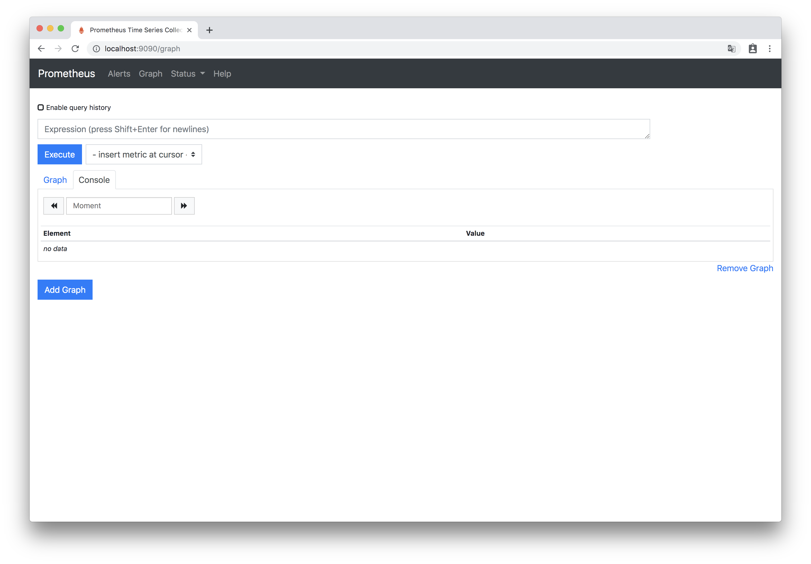
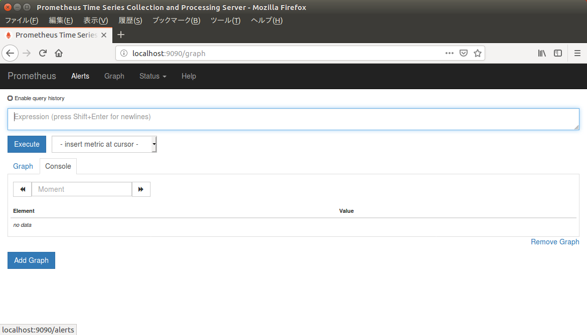
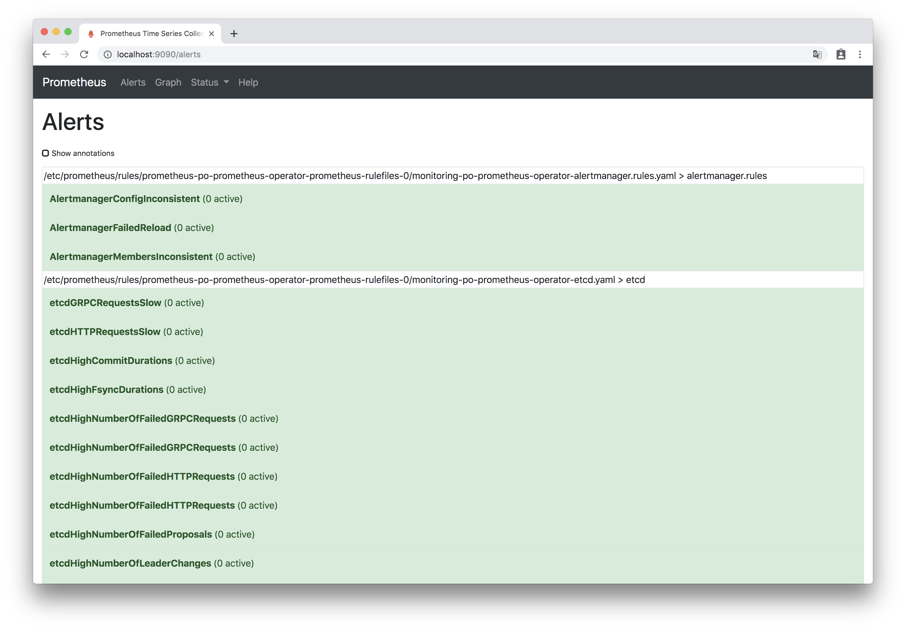
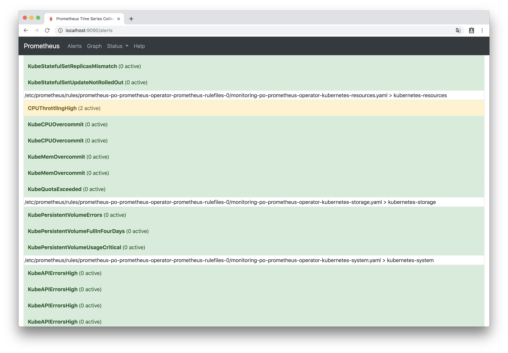
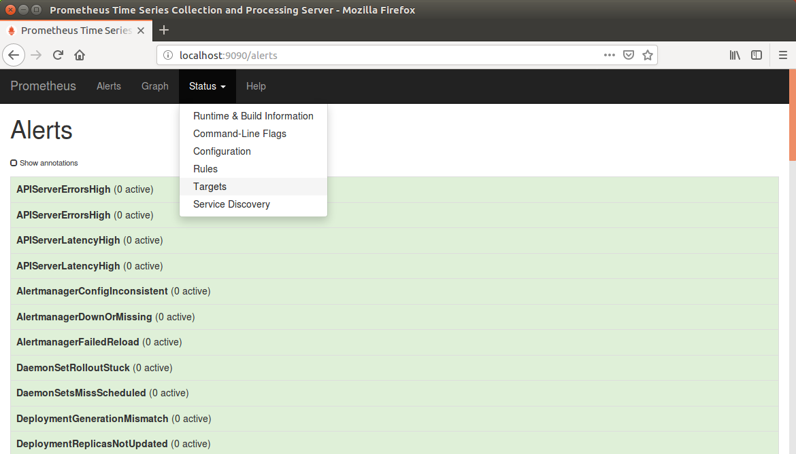
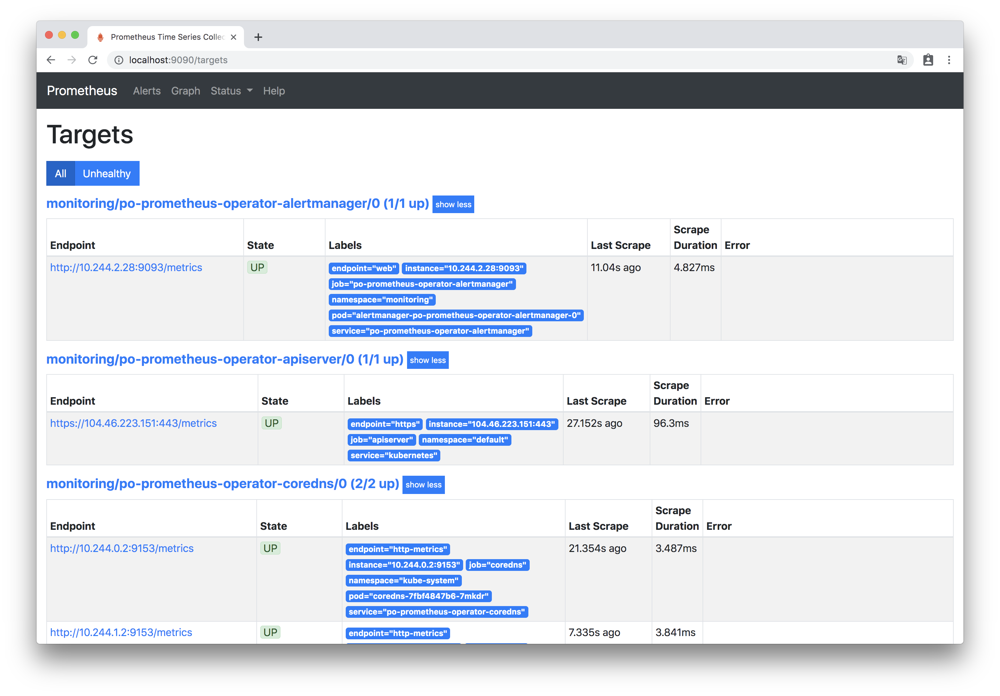
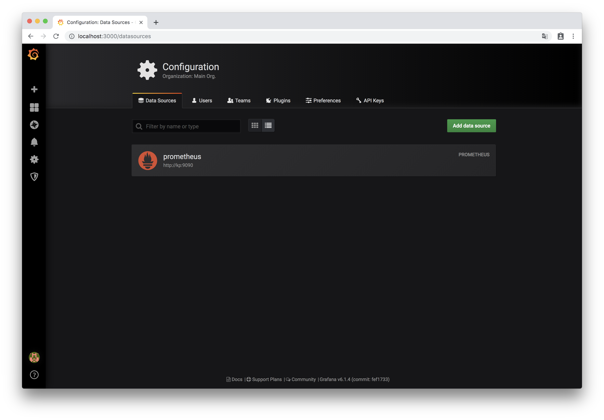
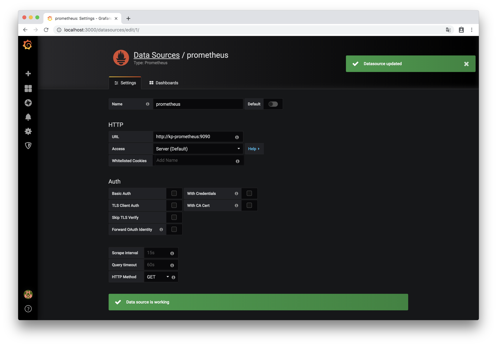

# RoboticBase Coreインストールマニュアル #5

## 環境構築(2019年4月26日現在)

# AKSでモニターリング＆ロギングの開始

## 環境変数設定

1. 環境変数の設定

    ```
    $ export CORE_ROOT=${HOME}/core
    ```

1. 環境設定の読み込み

    ```
    $ source ${CORE_ROOT}/docs/environments/azure_aks/env
    ```

## AKSでfiware cygnus(elasticsearch sink)を起動

1. cygnus-elasticsearch-serviceの作成

    ```
    $ kubectl apply -f cygnus/cygnus-elasticsearch-service.yaml
    ```

    - 実行結果（例）

        ```
        service/cygnus-elasticsearch created
        ```

1. cygnus-elasticsearch-deploymentの作成

    ```
    $ kubectl apply -f cygnus/cygnus-elasticsearch-deployment.yaml
    ```

    - 実行結果（例）

        ```
        deployment.apps/cygnus-elasticsearch created
        ```

1. cygnus-elasticsearchのpods状態確認

    ```
    $ kubectl get pods -l app=cygnus-elasticsearch
    ```

    - 実行結果（例）

        ```
        NAME                                    READY   STATUS    RESTARTS   AGE
        cygnus-elasticsearch-8575567db7-g7rb4   1/1     Running   0          2m13s
        cygnus-elasticsearch-8575567db7-jjnvt   1/1     Running   0          2m13s
        cygnus-elasticsearch-8575567db7-v5lb8   1/1     Running   0          2m13s
        ```

1. cygnus-elasticsearchのservices状態確認

    ```
    $ kubectl get services -l app=cygnus-elasticsearch
    ```

    - 実行結果（例）

        ```
        NAME                   TYPE        CLUSTER-IP     EXTERNAL-IP   PORT(S)             AGE
        cygnus-elasticsearch   ClusterIP   10.0.120.210   <none>        5050/TCP,8081/TCP   6m28s
        ```


## prometheusとgrafanaの設定

1. prometheus-operatorのインストール

    ```
    $ helm install stable/prometheus-operator --name po --namespace monitoring -f monitoring/prometheus-operator-azure.yaml
    ```

    - 実行結果（例）

        ```
        NAME:   po
        LAST DEPLOYED: Sat Jul  6 12:52:49 2019
        NAMESPACE: monitoring
        STATUS: DEPLOYED

        RESOURCES:
        ==> v1/Alertmanager
        NAME                                 AGE
        po-prometheus-operator-alertmanager  3s

        ==> v1/ClusterRole
        NAME                                   AGE
        po-grafana-clusterrole                 5s
        po-prometheus-operator-alertmanager    4s
        po-prometheus-operator-operator        4s
        po-prometheus-operator-operator-psp    4s
        po-prometheus-operator-prometheus      4s
        po-prometheus-operator-prometheus-psp  4s
        psp-po-kube-state-metrics              4s

        ==> v1/ClusterRoleBinding
        NAME                                   AGE
        po-grafana-clusterrolebinding          4s
        po-prometheus-operator-alertmanager    4s
        po-prometheus-operator-operator        4s
        po-prometheus-operator-operator-psp    4s
        po-prometheus-operator-prometheus      4s
        po-prometheus-operator-prometheus-psp  4s
        psp-po-kube-state-metrics              4s

        ==> v1/ConfigMap
        NAME                                                      DATA  AGE
        po-grafana                                                1     5s
        po-grafana-config-dashboards                              1     5s
        po-grafana-test                                           1     5s
        po-prometheus-operator-etcd                               1     5s
        po-prometheus-operator-grafana-datasource                 1     5s
        po-prometheus-operator-k8s-cluster-rsrc-use               1     5s
        po-prometheus-operator-k8s-coredns                        1     5s
        po-prometheus-operator-k8s-node-rsrc-use                  1     5s
        po-prometheus-operator-k8s-resources-cluster              1     5s
        po-prometheus-operator-k8s-resources-namespace            1     5s
        po-prometheus-operator-k8s-resources-pod                  1     5s
        po-prometheus-operator-k8s-resources-workload             1     5s
        po-prometheus-operator-k8s-resources-workloads-namespace  1     5s
        po-prometheus-operator-nodes                              1     5s
        po-prometheus-operator-persistentvolumesusage             1     5s
        po-prometheus-operator-pods                               1     5s
        po-prometheus-operator-statefulset                        1     5s

        ==> v1/Deployment
        NAME                             READY  UP-TO-DATE  AVAILABLE  AGE
        po-kube-state-metrics            0/1    1           0          4s
        po-prometheus-operator-operator  0/1    1           0          4s

        ==> v1/Pod(related)
        NAME                                              READY  STATUS             RESTARTS  AGE
        po-grafana-d7fd78f54-69tx7                        0/2    Init:0/1           0         3s
        po-kube-state-metrics-64fdf7d84d-zmnxj            0/1    ContainerCreating  0         3s
        po-prometheus-node-exporter-77cdm                 0/1    ContainerCreating  0         4s
        po-prometheus-node-exporter-cq9wr                 0/1    Running            0         3s
        po-prometheus-node-exporter-q94h5                 0/1    ContainerCreating  0         3s
        po-prometheus-operator-operator-7776c6dd9f-vswv9  0/1    ContainerCreating  0         3s

        ==> v1/Prometheus
        NAME                               AGE
        po-prometheus-operator-prometheus  3s

        ==> v1/PrometheusRule
        NAME                                                         AGE
        po-prometheus-operator-alertmanager.rules                    3s
        po-prometheus-operator-etcd                                  3s
        po-prometheus-operator-general.rules                         3s
        po-prometheus-operator-k8s.rules                             3s
        po-prometheus-operator-kube-apiserver.rules                  3s
        po-prometheus-operator-kube-prometheus-node-alerting.rules   3s
        po-prometheus-operator-kube-prometheus-node-recording.rules  3s
        po-prometheus-operator-kube-scheduler.rules                  3s
        po-prometheus-operator-kubernetes-absent                     3s
        po-prometheus-operator-kubernetes-apps                       3s
        po-prometheus-operator-kubernetes-resources                  3s
        po-prometheus-operator-kubernetes-storage                    3s
        po-prometheus-operator-kubernetes-system                     3s
        po-prometheus-operator-node-network                          3s
        po-prometheus-operator-node-time                             3s
        po-prometheus-operator-node.rules                            3s
        po-prometheus-operator-prometheus-operator                   2s
        po-prometheus-operator-prometheus.rules                      2s

        ==> v1/Role
        NAME             AGE
        po-grafana-test  4s

        ==> v1/RoleBinding
        NAME             AGE
        po-grafana-test  4s

        ==> v1/Secret
        NAME                                              TYPE    DATA  AGE
        alertmanager-po-prometheus-operator-alertmanager  Opaque  1     6s
        po-grafana                                        Opaque  3     6s

        ==> v1/Service
        NAME                                            TYPE       CLUSTER-IP    EXTERNAL-IP  PORT(S)    AGE
        po-grafana                                      ClusterIP  10.0.17.182   <none>       80/TCP     4s
        po-kube-state-metrics                           ClusterIP  10.0.199.68   <none>       8080/TCP   4s
        po-prometheus-node-exporter                     ClusterIP  10.0.39.247   <none>       9100/TCP   4s
        po-prometheus-operator-alertmanager             ClusterIP  10.0.59.136   <none>       9093/TCP   4s
        po-prometheus-operator-coredns                  ClusterIP  None          <none>       9153/TCP   4s
        po-prometheus-operator-kube-controller-manager  ClusterIP  None          <none>       10252/TCP  4s
        po-prometheus-operator-kube-etcd                ClusterIP  None          <none>       2379/TCP   4s
        po-prometheus-operator-kube-scheduler           ClusterIP  None          <none>       10251/TCP  4s
        po-prometheus-operator-operator                 ClusterIP  10.0.187.114  <none>       8080/TCP   4s
        po-prometheus-operator-prometheus               ClusterIP  10.0.151.62   <none>       9090/TCP   4s

        ==> v1/ServiceAccount
        NAME                                 SECRETS  AGE
        po-grafana                           1        5s
        po-grafana-test                      1        5s
        po-kube-state-metrics                1        5s
        po-prometheus-node-exporter          1        5s
        po-prometheus-operator-alertmanager  1        5s
        po-prometheus-operator-operator      1        5s
        po-prometheus-operator-prometheus    1        5s

        ==> v1/ServiceMonitor
        NAME                                            AGE
        po-prometheus-operator-alertmanager             2s
        po-prometheus-operator-apiserver                2s
        po-prometheus-operator-coredns                  2s
        po-prometheus-operator-grafana                  2s
        po-prometheus-operator-kube-controller-manager  2s
        po-prometheus-operator-kube-etcd                2s
        po-prometheus-operator-kube-scheduler           2s
        po-prometheus-operator-kube-state-metrics       2s
        po-prometheus-operator-kubelet                  2s
        po-prometheus-operator-node-exporter            2s
        po-prometheus-operator-operator                 2s
        po-prometheus-operator-prometheus               2s

        ==> v1beta1/ClusterRole
        NAME                             AGE
        po-kube-state-metrics            5s
        psp-po-prometheus-node-exporter  4s

        ==> v1beta1/ClusterRoleBinding
        NAME                             AGE
        po-kube-state-metrics            4s
        psp-po-prometheus-node-exporter  4s

        ==> v1beta1/DaemonSet
        NAME                         DESIRED  CURRENT  READY  UP-TO-DATE  AVAILABLE  NODE SELECTOR  AGE
        po-prometheus-node-exporter  3        3        0      3           0          <none>         4s

        ==> v1beta1/PodSecurityPolicy
        NAME                                 PRIV   CAPS      SELINUX           RUNASUSER  FSGROUP    SUPGROUP  READONLYROOTFS  VOLUMES
        po-grafana                           false  RunAsAny  RunAsAny          RunAsAny   RunAsAny   false     configMap,emptyDir,projected,secret,downwardAPI,persistentVolumeClaim
        po-grafana-test                      false  RunAsAny  RunAsAny          RunAsAny   RunAsAny   false     configMap,downwardAPI,emptyDir,projected,secret
        po-kube-state-metrics                false  RunAsAny  MustRunAsNonRoot  MustRunAs  MustRunAs  false     secret
        po-prometheus-node-exporter          false  RunAsAny  RunAsAny          MustRunAs  MustRunAs  false     configMap,emptyDir,projected,secret,downwardAPI,persistentVolumeClaim,hostPath
        po-prometheus-operator-alertmanager  false  RunAsAny  RunAsAny          MustRunAs  MustRunAs  false     configMap,emptyDir,projected,secret,downwardAPI,persistentVolumeClaim
        po-prometheus-operator-operator      false  RunAsAny  RunAsAny          MustRunAs  MustRunAs  false     configMap,emptyDir,projected,secret,downwardAPI,persistentVolumeClaim
        po-prometheus-operator-prometheus    false  RunAsAny  RunAsAny          MustRunAs  MustRunAs  false     configMap,emptyDir,projected,secret,downwardAPI,persistentVolumeClaim

        ==> v1beta1/Role
        NAME        AGE
        po-grafana  4s

        ==> v1beta1/RoleBinding
        NAME        AGE
        po-grafana  4s

        ==> v1beta2/Deployment
        NAME        READY  UP-TO-DATE  AVAILABLE  AGE
        po-grafana  0/1    1           0          4s


        NOTES:
        The Prometheus Operator has been installed. Check its status by running:
          kubectl --namespace monitoring get pods -l "release=po"

        Visit https://github.com/coreos/prometheus-operator for instructions on how
        to create & configure Alertmanager and Prometheus instances using the Operator.
        ```

1. prometheus-operatorのpods状態確認

    ```
    $ kubectl --namespace monitoring get pods -l "app=prometheus-operator-operator,release=po"
    ```

    - 実行結果（例）

        ```
        NAME                                               READY   STATUS    RESTARTS   AGE
        po-prometheus-operator-operator-7cf7c5cc97-78h9g   1/1     Running   0          2m28s
        ```

1. monitoringネームスペースのdaemonsets状態確認

    ```
    $ kubectl get daemonsets --namespace monitoring
    ```

    - 実行結果（例）

        ```
        NAME                          DESIRED   CURRENT   READY   UP-TO-DATE   AVAILABLE   NODE SELECTOR   AGE
        po-prometheus-node-exporter   4         4         4       4            4           <none>          2m48s
        ```

1. monitoringネームスペースのdeploymentsを確認

    ```
    $ kubectl get deployments --namespace monitoring
    ```

    - 実行結果（例）

        ```
        NAME                              READY   UP-TO-DATE   AVAILABLE   AGE
        po-grafana                        1/1     1            1           3m51s
        po-kube-state-metrics             1/1     1            1           3m51s
        po-prometheus-operator-operator   1/1     1            1           3m51s
        ```

1. monitoringネームスペースのstatefulsetsを確認

    ```
    $ kubectl get statefulsets --namespace monitoring
    ```

    - 実行結果（例）

        ```
        NAME                                               READY   AGE
        alertmanager-po-prometheus-operator-alertmanager   1/1     3m44s
        prometheus-po-prometheus-operator-prometheus       1/1     3m34s
        ```

1. monitoringネームスペースのpods状態確認

    ```
    $ kubectl get pods --namespace monitoring
    ```

    - 実行結果（例）

        ```
        NAME                                                 READY   STATUS    RESTARTS   AGE
        alertmanager-po-prometheus-operator-alertmanager-0   2/2     Running   0          3m56s
        po-grafana-fbc85bc4b-5k2s8                           2/2     Running   0          4m32s
        po-kube-state-metrics-64fdf7d84d-v9d8h               1/1     Running   0          4m32s
        po-prometheus-node-exporter-4fptr                    1/1     Running   0          4m32s
        po-prometheus-node-exporter-92lzp                    1/1     Running   0          4m32s
        po-prometheus-node-exporter-h8hff                    1/1     Running   0          4m32s
        po-prometheus-node-exporter-76pc4                    1/1     Running   0          4m32s
        po-prometheus-operator-operator-7cf7c5cc97-78h9g     1/1     Running   0          4m32s
        prometheus-po-prometheus-operator-prometheus-0       3/3     Running   1          3m46s
        ```

1. monitoringネームスペースのservices状態確認

    ```
    $ kubectl get services --namespace monitoring
    ```

    - 実行結果（例）

        ```
        NAME                                  TYPE        CLUSTER-IP     EXTERNAL-IP   PORT(S)             AGE
        alertmanager-operated                 ClusterIP   None           <none>        9093/TCP,6783/TCP   6m4s
        po-grafana                            ClusterIP   10.0.67.251    <none>        80/TCP              6m40s
        po-kube-state-metrics                 ClusterIP   10.0.104.75    <none>        8080/TCP            6m40s
        po-prometheus-node-exporter           ClusterIP   10.0.103.93    <none>        9100/TCP            6m40s
        po-prometheus-operator-alertmanager   ClusterIP   10.0.57.200    <none>        9093/TCP            6m40s
        po-prometheus-operator-operator       ClusterIP   10.0.37.49     <none>        8080/TCP            6m40s
        po-prometheus-operator-prometheus     ClusterIP   10.0.229.252   <none>        9090/TCP            6m40s
        prometheus-operated                   ClusterIP   None           <none>        9090/TCP            5m54s
        ```

1. monitoringネームスペースのpersistentvolumeclaims状態確認

    ```
    $ kubectl get persistentvolumeclaims --namespace monitoring
    ```

    - 実行結果（例）

        ```
        NAME                                                                                       STATUS   VOLUME                                     CAPACITY   ACCESS MODES   STORAGECLASS      AGE
        prometheus-alertmanager-storage-claim-alertmanager-po-prometheus-operator-alertmanager-0   Bound    pvc-82a98fe2-9f94-11e9-8e06-7200ae7cb77a   30Gi       RWO            managed-premium   119s
        prometheus-prometheus-storage-claim-prometheus-po-prometheus-operator-prometheus-0         Bound    pvc-88b5edbb-9f94-11e9-8e06-7200ae7cb77a   30Gi       RWO            managed-premium   109s
        ```

## prometheusルールの編集

1. general.rulesの編集

    ```
    $ kubectl edit --namespace=monitoring prometheusrules po-prometheus-operator-general.rules
    ```

    ※先頭に-の付いている部分を削除してください

    ```diff
           for: 10m
           labels:
             severity: warning
    -    - alert: Watchdog
    -      annotations:
    -        message: |
    -          This is an alert meant to ensure that the entire alerting pipeline is functional.
    -          This alert is always firing, therefore it should always be firing in Alertmanager
    -          and always fire against a receiver. There are integrations with various notification
    -          mechanisms that send a notification when this alert is not firing. For example the
    -          "DeadMansSnitch" integration in PagerDuty.
    -      expr: vector(1)
    -      labels:
    -        severity: none
    ```

1. kubernetes-absentの編集

    ```
    $ kubectl edit --namespace=monitoring prometheusrules po-prometheus-operator-kubernetes-absent
    ```

    ※先頭に-の付いている部分を削除、先頭に+の付いている部分を追加してください

    ```diff
           for: 15m
           labels:
             severity: critical
    -    - alert: KubeControllerManagerDown
    -      annotations:
    -        message: KubeControllerManager has disappeared from Prometheus target discovery.
    -        runbook_url: https://github.com/kubernetes-monitoring/kubernetes-mixin/tree/master/runbook.md#alert-name-kubecontrollermanagerdown
    -      expr: absent(up{job="kube-controller-manager"} == 1)
    -      for: 15m
    -      labels:
    -        severity: critical
    -    - alert: KubeSchedulerDown
    -      annotations:
    -        message: KubeScheduler has disappeared from Prometheus target discovery.
    -        runbook_url: https://github.com/kubernetes-monitoring/kubernetes-mixin/tree/master/runbook.md#alert-name-kubeschedulerdown
    -      expr: absent(up{job="kube-scheduler"} == 1)
    -      for: 15m
    -      labels:
    -        severity: critical
         - alert: KubeStateMetricsDown
           annotations:
             message: KubeStateMetrics has disappeared from Prometheus target discovery.
    ```

## prometheusの確認

1. 別ターミナルを開き、prometheusのポートフォワーディングを開始

    ```
    $ kubectl --namespace monitoring port-forward $(kubectl get pod --namespace monitoring -l prometheus=kube-prometheus -l app=prometheus -o template --template "{{(index .items 0).metadata.name}}") 9090:9090
    ```

    - 実行結果（例）

        ```
        Forwarding from 127.0.0.1:9090 -> 9090
        Forwarding from [::1]:9090 -> 9090
        ```
1. ブラウザでprometheusにアクセス
    * macOS

        ```
        $ open http://localhost:9090
        ```
    * Ubuntu

        ```
        $ xdg-open http://localhost:9090
        ```
1. prometheusのWEB管理画面が表示されたことを確認

    

1. 「Alerts」を選択

    

1. CPUやMemoryのリソース使用量警告以外のすべてのアラートが「0 active」と表示されることを確認

    
    

1. メニューから「Status」「Targets」をクリック

    

1. すべての「State」が「UP」になっていることを確認

    

1. ブラウザを終了

1. Ctrl-Cでport-forwardingを終了し、別ターミナル閉じる


## grafanaのServiceにpatch
1. ambassadorのルーティングルールをannotationとして追記

    ```
    $ kubectl patch service --namespace monitoring po-grafana -p '{"metadata": {"annotations": {"getambassador.io/config": "---\napiVersion: ambassador/v0\nkind:  Mapping\nname:  grafana-mapping\nprefix: /\nhost: \"^grafana\\\\..+$\"\nhost_regex: true\nservice: http://po-grafana.monitoring:80\n"}}}'
    ```

    - 実行結果（例）

        ```
        service/po-grafana patched
        ```

## grafanaのサブドメインをDNSレコードに追加

1. ambassadorのグローバルIPアドレスを取得

    ```
    $ HTTPS_IPADDR=$(kubectl get services -l app=ambassador -o json | jq '.items[0].status.loadBalancer.ingress[0].ip' -r)
    ```

1. ambassadorのサブドメイン（ `grafana` ）をDNSレコードを追加

    ```
    $ az network dns record-set a add-record --resource-group ${DNS_ZONE_RG} --zone-name "${DOMAIN}" --record-set-name "grafana" --ipv4-address "${HTTPS_IPADDR}"
    ```

    - 実行結果（例）

        ```json
        {
            "arecords": [
                {
                    "ipv4Address": "XX.XX.XX.XX"
                }
            ],
            "etag": "xxxxxxxx-xxxx-xxxx-xxxx-xxxxxxxxxxxx",
            "fqdn": "grafana.example.com.",
            "id": "/subscriptions/xxxxxxxx-xxxx-xxxx-xxxx-xxxxxxxxxxxx/resourceGroups/dns-zone/providers/Microsoft.Network/dnszones/example.com/A/api",
            "metadata": null,
            "name": "grafana",
            "provisioningState": "Succeeded",
            "resourceGroup": "dns-zone",
            "targetResource": {
                "id": null
            },
            "ttl": 3600,
            "type": "Microsoft.Network/dnszones/A"
        }
        ```

1. grafanaドメインの名前解決確認

    ```
    $ nslookup grafana.${DOMAIN}
    ```

    - 実行結果（例）

        ```
        Server:         127.0.1.1
        Address:        127.0.1.1#53

        Non-authoritative answer:
        Name:   grafana.example.com
        Address: XX.XX.XX.XX
        ```

1. grafanaドメインの確認

    ```
    $ curl -i https://grafana.${DOMAIN}
    ```

    - 実行結果（例）

        ```
        HTTP/1.1 302 Found
        content-type: text/html; charset=utf-8
        location: /login
        set-cookie: redirect_to=%252F; Path=/; HttpOnly
        date: Thu, 21 Feb 2019 00:32:29 GMT
        content-length: 29
        x-envoy-upstream-service-time: 1
        server: envoy

        <a href="/login">Found</a>.
        ```


## grafanaのパスワード変更とダッシュボード確認

1. ブラウザでgrafanaにアクセス
    * macOS

        ```
        $ open https://grafana.${DOMAIN}/login
        ```
    * Ubuntu

        ```
        $ xdg-open https://grafana.${DOMAIN}/login
        ```
1. grafanaのログイン画面が表示されたことを確認

    

1. 「email or username」に「admin」、「password」に「prom-operator」を入力し「Log In」をクリック

    

1. 左下の「Preferences」より、adminユーザのプロファイル画面を表示する

    
    

1. 「Change Password」よりパスワードの変更画面を表示し、パスワードを変更する

    
    

1. ホーム画面に遷移し、左上の「Home」をクリックしてprometheus-operatorがインストールしたダッシュボードのリストを表示する

    
    

1. 「Kubernetes / Compute Resouces / Cluster」をクリックし、AKSクラスタのリソース使用状況が表示されることを確認する

    

1. ブラウザを終了


## Elasticsearchの設定

1. elasticsearch-azure-serviceの作成

    ```
    $ kubectl apply -f logging/elasticsearch-azure-service.yaml
    ```

    - 実行結果（例）

        ```
        service/elasticsearch-logging created
        ```

1. elasticsearch-azure-deploymentの作成

    ```
    $ kubectl apply -f logging/elasticsearch-azure-deployment.yaml
    ```

    - 実行結果（例）

        ```
        serviceaccount/elasticsearch-logging created
        clusterrole.rbac.authorization.k8s.io/elasticsearch-logging created
        clusterrolebinding.rbac.authorization.k8s.io/elasticsearch-logging created
        statefulset.apps/elasticsearch-logging created
        ```

1. elasticsearch-loggingのstatefulsets状態確認

    ```
    $ kubectl get statefulsets --namespace monitoring -l k8s-app=elasticsearch-logging
    ```

    - 実行結果（例）

        ```
        NAME                    READY   AGE
        elasticsearch-logging   2/2     11m
        ```

1. elasticsearch-loggingのpods状態確認

    ```
    $ kubectl get pods --namespace monitoring -l k8s-app=elasticsearch-logging
    ```

    - 実行結果（例）

        ```
        NAME                      READY   STATUS    RESTARTS   AGE
        elasticsearch-logging-0   1/1     Running   0          11m
        elasticsearch-logging-1   1/1     Running   0          9m43s
        ```

1. elasticsearch-loggingのservices状態確認

    ```
    $ kubectl get services --namespace monitoring -l k8s-app=elasticsearch-logging
    ```

    - 実行結果（例）

        ```
        NAME                    TYPE        CLUSTER-IP     EXTERNAL-IP   PORT(S)    AGE
        elasticsearch-logging   ClusterIP   10.0.148.167   <none>        9200/TCP   7m45s
        ```

1. elastic-searchのpersistentvolumeclaims状態確認

    ```
    $ kubectl get persistentvolumeclaims -n monitoring -l k8s-app=elasticsearch-logging
    ```

    - 実行結果（例）

        ```
        NAME                                            STATUS   VOLUME                                     CAPACITY   ACCESS MODES   STORAGECLASS      AGE
        elasticsearch-logging-elasticsearch-logging-0   Bound    pvc-e71fe0c9-6735-11e9-935a-c2d9cfbaf97d   64Gi       RWO            managed-premium   12m
        elasticsearch-logging-elasticsearch-logging-1   Bound    pvc-31feed6c-6736-11e9-935a-c2d9cfbaf97d   64Gi       RWO            managed-premium   10m
        ```

1. elasticsearchのクラスタ設定の変更

    ```
    $ kubectl exec -it elasticsearch-logging-0 --namespace monitoring -- curl -H "Content-Type: application/json" -X PUT http://elasticsearch-logging:9200/_cluster/settings -d '{"transient": {"cluster.routing.allocation.enable":"all"}}'
    ```

    - 実行結果（例）

        ```
        {"acknowledged":true,"persistent":{},"transient":{"cluster":{"routing":{"allocation":{"enable":"all"}}}}}
        ```

## fluentdの設定

1. fluentd-es-configmapの作成

    ```
    $ kubectl apply -f logging/fluentd-es-configmap.yaml
    ```

    - 実行結果（例）

        ```
        configmap/fluentd-es-config-v0.2.0 created
        ```

1. fluentd-es-dsの作成

    ```
    $ kubectl apply -f logging/fluentd-es-ds.yaml
    ```

    - 実行結果（例）

        ```
        serviceaccount/fluentd-es created
        clusterrole.rbac.authorization.k8s.io/fluentd-es created
        clusterrolebinding.rbac.authorization.k8s.io/fluentd-es created
        daemonset.apps/fluentd-es-v2.4.0 created
        ```

1. fluentd-esのdaemonsets状態確認

    ```
    $ kubectl get daemonsets --namespace monitoring -l k8s-app=fluentd-es
    ```

    - 実行結果（例）

        ```
        NAME                DESIRED   CURRENT   READY   UP-TO-DATE   AVAILABLE   NODE SELECTOR   AGE
        fluentd-es-v2.4.0   4         4         4       4            4           <none>          113s
        ```

1. fluentd-esのpods状態確認

    ```
    $ kubectl get pods --namespace monitoring -l k8s-app=fluentd-es
    ```

    - 実行結果（例）

        ```
        NAME                      READY   STATUS    RESTARTS   AGE
        fluentd-es-v2.4.0-26fhm   1/1     Running   0          2m30s
        fluentd-es-v2.4.0-5ftbp   1/1     Running   0          2m30s
        fluentd-es-v2.4.0-cvrn4   1/1     Running   0          2m30s
        fluentd-es-v2.4.0-pv5nh   1/1     Running   0          2m30s
        ```

## Kibanaの設定

1. kibana-serviceの作成

    ```
    $ kubectl apply -f logging/kibana-service.yaml
    ```

    - 実行結果（例）

        ```
        service/kibana-logging created
        ```

1. kibana-deploymentの作成

    ```
    $ kubectl apply -f logging/kibana-deployment.yaml
    ```

    - 実行結果（例）

        ```
        deployment.apps/kibana-logging created
        ```

1. kibana-loggingのpods状態確認

    ```
    $ kubectl get pods --namespace monitoring -l k8s-app=kibana-logging
    ```

    - 実行結果（例）

        ```
        NAME                              READY   STATUS    RESTARTS   AGE
        kibana-logging-76ff7dbb49-mbzqd   1/1     Running   0          102s
        ```

## curatorの設定

1. curator-configmapの作成

    ```
    $ kubectl apply -f logging/curator-configmap.yaml
    ```

    - 実行結果（例）

        ```
        configmap/curator-config created
        ```

1. curator-cronjobの作成

    ```
    $ kubectl apply -f logging/curator-cronjob.yaml
    ```

    - 実行結果（例）

        ```
        cronjob.batch/elasticsearch-curator created
        ```

1. elasticsearch-curatorのcronjobs状態確認

    ```
    $ kubectl get cronjobs --namespace monitoring -l k8s-app=elasticsearch-curator
    ```

    - 実行結果（例）

        ```
        NAME                    SCHEDULE     SUSPEND   ACTIVE   LAST SCHEDULE   AGE
        elasticsearch-curator   0 18 * * *   False     0        <none>          2m28s
        ```

## kibanaのサブドメインをDNSレコードに追加

1. ambassadorのグローバルIPアドレスを取得

    ```
    $ HTTPS_IPADDR=$(kubectl get services -l app=ambassador -o json | jq '.items[0].status.loadBalancer.ingress[0].ip' -r)
    ```

1. ambassadorのサブドメイン（ `kibana` ）をDNSレコードを追加

    ```
    $ az network dns record-set a add-record --resource-group ${DNS_ZONE_RG} --zone-name "${DOMAIN}" --record-set-name "kibana" --ipv4-address "${HTTPS_IPADDR}"
    ```

    - 実行結果（例）

        ```json
        {
            "arecords": [
                {
                    "ipv4Address": "XX.XX.XX.XX"
                }
            ],
            "etag": "xxxxxxxx-xxxx-xxxx-xxxx-xxxxxxxxxxxx",
            "fqdn": "kibana.example.com.",
            "id": "/subscriptions/xxxxxxxx-xxxx-xxxx-xxxx-xxxxxxxxxxxx/resourceGroups/dns-zone/providers/Microsoft.Network/dnszones/example.com/A/api",
            "metadata": null,
            "name": "kibana",
            "provisioningState": "Succeeded",
            "resourceGroup": "dns-zone",
            "targetResource": {
                "id": null
            },
            "ttl": 3600,
            "type": "Microsoft.Network/dnszones/A"
        }
        ```

1. grafanaドメインの名前解決確認

    ```
    $ nslookup kibana.${DOMAIN}
    ```

    - 実行結果（例）

        ```
        Server:         127.0.1.1
        Address:        127.0.1.1#53

        Non-authoritative answer:
        Name:   kibana.example.com
        Address: XX.XX.XX.XX
        ```

1. kibanaドメインの確認

    ```
    $ curl -i https://kibana.${DOMAIN}
    ```

    - 実行結果（例）

        ```
        HTTP/1.1 401 Unauthorized
        www-authenticate: Basic realm="basic authentication required"
        content-length: 0
        date: Thu, 21 Feb 2019 00:32:29 GMT
        server: envoy
        ```


## KibanaにIndex Patternsの設定

1. ユーザ名とパスワードの確認
    * ユーザ名

        ```
        $ cat ${CORE_ROOT}/secrets/auth-tokens.json | jq '.[]|select(.host == "kibana\\..+$")|.settings.basic_auths[0].username' -r
        ```
    * パスワード

        ```
        $ cat ${CORE_ROOT}/secrets/auth-tokens.json | jq '.[]|select(.host == "kibana\\..+$")|.settings.basic_auths[0].password' -r
        ```
1. ブラウザでkibanaにアクセス
    * macOS

        ```
        $ open https://kibana.${DOMAIN}/
        ```
    * Ubuntu
        ```
        $ xdg-open https://kibana.${DOMAIN}/
        ```
1. ユーザ名とパスワードを入力し、ログイン

    

1. KibanaのWEB管理画面が表示されたことを確認

    

1. 「Management」をクリック

    

1. 「Index Patterns」をクリック

    

1. 「Index pattern」のテキストボックスに「logstash-*」を入力

    

1. 「Success!」のメッセージが表示されたことを確認し「Next step」をクリック

    

1. 「Time Filter field name」のテキストボックスで「@timestamp」を選択し「Create Index pattern」をクリック

    

1. 「logstash-*」が作成されたことを確認

    

1. 「Discover」をクリックすると、Kubernetesやコンテナのログが表示される

    

1. ブラウザを終了


## grafanaにelasticsearch dashboardの追加

1. ブラウザでgrafanaにアクセス
    * macOS

        ```
        $ open https://grafana.${DOMAIN}/login
        ```
    * Ubuntu

        ```
        $ xdg-open https://grafana.${DOMAIN}/login
        ```
1. grafanaのWEB管理画面が表示されたことを確認

    

1. 「歯車」「Data Sources」をクリック

    

1. 「Add data source」をクリック

    

1. 「ElasticSearch」をクリック

    

1. 下記の設定値を入力し、「Save & Test」をクリック

    Name : elasticsearch  
    URL : http://elasticsearch-logging:9200  
    Access : Server(Default)  
    Index name : logstash-*  
    Time field name : @timestamp  
    Version : 6.0+

    

1. 「Datasource Updated」と表示されることを確認

    

1. 「+」「Import」をクリック

    

1. 「Upload .json File」をクリック

    

1. 「monitoring/dashboard\_elasticsearch.json」を選択し「開く」をクリック

    

1. 「Import」をクリック

    

1. ElasticSeartchのログ件数のグラフとログ内容のテーブルが表示されることを確認

    

1. ブラウザを終了
