# RoboticBase Coreインストールマニュアル #3

## 環境構築(2019年2月26日現在)


# AKSでモニターリング＆ロギングの開始

## 環境変数設定

1. 環境変数の設定

    ```
    $ export CORE_ROOT=${HOME}/core
    ```

1. 環境設定の読み込み

    ```
    $ source ${CORE_ROOT}/docs/azure_aks/env
    ```

## cygnus-elasticsearchの設定

1. cygnus-elasticsearch-serviceの作成

    ```
    $ kubectl apply -f cygnus/cygnus-elasticsearch-service.yaml
    ```

    - 実行結果（例）

      ```
      service/cygnus-elasticsearch created
      ```

1. cygnus-elasticsearch-deploymentの作成

    ```
    $ kubectl apply -f cygnus/cygnus-elasticsearch-deployment.yaml
    ```

    - 実行結果（例）

      ```
      deployment.apps/cygnus-elasticsearch created
      ```

1. cygnus-elasticsearchのpods状態確認

    ```
    $ kubectl get pods -l app=cygnus-elasticsearch
    ```

    - 実行結果（例）

      ```
      NAME                                    READY   STATUS    RESTARTS   AGE
      cygnus-elasticsearch-8575567db7-g7rb4   1/1     Running   0          2m13s
      cygnus-elasticsearch-8575567db7-jjnvt   1/1     Running   0          2m13s
      cygnus-elasticsearch-8575567db7-v5lb8   1/1     Running   0          2m13s
      ```

1. cygnus-elasticsearchのservices状態確認

    ```
    $ kubectl get services -l app=cygnus-elasticsearch
    ````

    - 実行結果（例）

      ```
      NAME                   TYPE        CLUSTER-IP     EXTERNAL-IP   PORT(S)             AGE
      cygnus-elasticsearch   ClusterIP   10.0.120.210   <none>        5050/TCP,8081/TCP   6m28s
      ```


## prometheusとgrafanaの設定

1. リポジトリにcoreosの追加

    ```
    $ helm repo add coreos https://s3-eu-west-1.amazonaws.com/coreos-charts/stable/
    ```

    - 実行結果（例）

      ```
      "coreos" has been added to your repositories
      ```

1. prometheus-operatorのインストール

    ```
    $ helm install coreos/prometheus-operator --name po --namespace monitoring
    ```

    - 実行結果（例）

      ```
      NAME:   po
      LAST DEPLOYED: Thu Feb 21 16:41:53 2019
      NAMESPACE: monitoring
      STATUS: DEPLOYED

      RESOURCES:
      ==> v1beta1/Deployment
      NAME                    DESIRED  CURRENT  UP-TO-DATE  AVAILABLE  AGE
      po-prometheus-operator  1        1        1           1          2m

      ==> v1beta1/PodSecurityPolicy
      NAME                    PRIV   CAPS  SELINUX   RUNASUSER  FSGROUP    SUPGROUP   READONLYROOTFS  VOLUMES
      po-prometheus-operator  false  []    RunAsAny  RunAsAny   MustRunAs  MustRunAs  false           [configMap emptyDir projected secret downwardAPI persistentVolumeClaim]

      ==> v1/ConfigMap
      NAME                    DATA  AGE
      po-prometheus-operator  1     2m

      ==> v1/ServiceAccount
      NAME                    SECRETS  AGE
      po-prometheus-operator  1        2m

      ==> v1beta1/ClusterRole
      NAME                        AGE
      psp-po-prometheus-operator  2m
      po-prometheus-operator      2m

      ==> v1beta1/ClusterRoleBinding
      NAME                        AGE
      psp-po-prometheus-operator  2m
      po-prometheus-operator      2m

      NOTES:
      The Prometheus Operator has been installed. Check its status by running:
        kubectl --namespace monitoring get pods -l "app=prometheus-operator,release=po"

      Visit https://github.com/coreos/prometheus-operator for instructions on how
      to create & configure Alertmanager and Prometheus instances using the Operator.
      ```

1. prometheus-operatorのpods状態確認

    ```
    $ kubectl --namespace monitoring get pods -l "app=prometheus-operator,release=po"
    ```

    - 実行結果（例）

      ```
      NAME                                         READY   STATUS      RESTARTS   AGE
      po-prometheus-operator-56956994f-tnqth       1/1     Running     0          5m40s
      ```

1. kube-prometheusのインストール

    ```
    $ helm install coreos/kube-prometheus --name kp --namespace monitoring -f monitoring/kube-prometheus-azure.yaml
    ```

    - 実行結果（例）

      ```
      NAME:   kp
      LAST DEPLOYED: Thu Feb 21 17:07:49 2019
      NAMESPACE: monitoring
      STATUS: DEPLOYED

      RESOURCES:
      ==> v1beta1/DaemonSet
      NAME              DESIRED  CURRENT  READY  UP-TO-DATE  AVAILABLE  NODE-SELECTOR  AGE
      kp-exporter-node  4        4        0      4           0          <none>         4s

      ==> v1beta1/Deployment
      NAME                    DESIRED  CURRENT  UP-TO-DATE  AVAILABLE  AGE
      kp-grafana              1        1        1           0          4s
      kp-exporter-kube-state  1        1        1           0          4s

      ==> v1/Alertmanager
      NAME  KIND
      kp    Alertmanager.v1.monitoring.coreos.com

      ==> v1/ServiceAccount
      NAME                    SECRETS  AGE
      kp-exporter-node        1        5s
      kp-exporter-kube-state  1        5s
      kp-grafana              1        5s
      kp-prometheus           1        4s

      ==> v1beta1/ClusterRoleBinding
      NAME                        AGE
      psp-kp-grafana              4s
      psp-kp-exporter-kube-state  4s
      kp-prometheus               4s
      kp-exporter-kube-state      4s
      psp-kp-alertmanager         4s
      psp-kp-exporter-node        4s
      psp-kp-prometheus           4s

      ==> v1beta1/Role
      NAME                    AGE
      kp-exporter-kube-state  4s

      ==> v1/ServiceMonitor
      NAME                                 KIND
      kp-exporter-kube-scheduler           ServiceMonitor.v1.monitoring.coreos.com
      kp-exporter-kubelets                 ServiceMonitor.v1.monitoring.coreos.com
      kp-alertmanager                      ServiceMonitor.v1.monitoring.coreos.com
      kp-exporter-kube-etcd                ServiceMonitor.v1.monitoring.coreos.com
      kp-exporter-coredns                  ServiceMonitor.v1.monitoring.coreos.com
      kp-grafana                           ServiceMonitor.v1.monitoring.coreos.com
      kp-exporter-node                     ServiceMonitor.v1.monitoring.coreos.com
      kp-exporter-kubernetes               ServiceMonitor.v1.monitoring.coreos.com
      kp-exporter-kube-state               ServiceMonitor.v1.monitoring.coreos.com
      kp-prometheus                        ServiceMonitor.v1.monitoring.coreos.com
      kp-exporter-kube-controller-manager  ServiceMonitor.v1.monitoring.coreos.com

      ==> v1/Service
      NAME                                 CLUSTER-IP    EXTERNAL-IP  PORT(S)    AGE
      kp-exporter-kube-scheduler           None          <none>       10251/TCP  4s
      kp-exporter-coredns                  None          <none>       9153/TCP   4s
      kp-prometheus                        10.0.238.197  <none>       9090/TCP   4s
      kp-grafana                           10.0.137.243  <none>       80/TCP     4s
      kp-exporter-kube-etcd                None          <none>       4001/TCP   4s
      kp-exporter-kube-state               10.0.196.239  <none>       80/TCP     4s
      kp-exporter-node                     10.0.35.21    <none>       9100/TCP   4s
      kp-exporter-kube-controller-manager  None          <none>       10252/TCP  4s
      kp-alertmanager                      10.0.79.224   <none>       9093/TCP   4s

      ==> v1/Prometheus
      NAME           KIND
      kp-prometheus  Prometheus.v1.monitoring.coreos.com

      ==> v1/ConfigMap
      NAME        DATA  AGE
      kp-grafana  10    5s

      ==> v1beta1/RoleBinding
      NAME                    AGE
      kp-exporter-kube-state  4s

      ==> v1/PrometheusRule
      NAME                                 KIND
      kp-exporter-kube-controller-manager  PrometheusRule.v1.monitoring.coreos.com
      kp-exporter-kubernetes               PrometheusRule.v1.monitoring.coreos.com
      kp-exporter-kube-etcd                PrometheusRule.v1.monitoring.coreos.com
      kp-kube-prometheus                   PrometheusRule.v1.monitoring.coreos.com
      kp-exporter-node                     PrometheusRule.v1.monitoring.coreos.com
      kp-exporter-kube-scheduler           PrometheusRule.v1.monitoring.coreos.com
      kp-alertmanager                      PrometheusRule.v1.monitoring.coreos.com
      kp-exporter-kube-state               PrometheusRule.v1.monitoring.coreos.com
      kp-exporter-kubelets                 PrometheusRule.v1.monitoring.coreos.com
      kp-prometheus-rules                  PrometheusRule.v1.monitoring.coreos.com

      ==> v1beta1/PodSecurityPolicy
      NAME                    PRIV   CAPS  SELINUX   RUNASUSER  FSGROUP    SUPGROUP   READONLYROOTFS  VOLUMES
      kp-alertmanager         false  []    RunAsAny  RunAsAny   MustRunAs  MustRunAs  false           [configMap emptyDir projected secret downwardAPI persistentVolumeClaim]
      kp-prometheus           false  []    RunAsAny  RunAsAny   MustRunAs  MustRunAs  false           [configMap emptyDir projected secret downwardAPI persistentVolumeClaim]
      kp-grafana              false  []    RunAsAny  RunAsAny   MustRunAs  MustRunAs  false           [configMap emptyDir projected secret downwardAPI persistentVolumeClaim hostPath]
      kp-exporter-kube-state  false  []    RunAsAny  RunAsAny   MustRunAs  MustRunAs  false           [configMap emptyDir projected secret downwardAPI persistentVolumeClaim]
      kp-exporter-node        false  []    RunAsAny  RunAsAny   MustRunAs  MustRunAs  false           [configMap emptyDir projected secret downwardAPI persistentVolumeClaim hostPath]

      ==> v1/Secret
      NAME             TYPE    DATA  AGE
      kp-grafana       Opaque  2     5s
      alertmanager-kp  Opaque  1     5s

      ==> v1beta1/ClusterRole
      NAME                        AGE
      kp-exporter-kube-state      4s
      psp-kp-grafana              4s
      kp-prometheus               4s
      psp-kp-exporter-node        4s
      psp-kp-alertmanager         4s
      psp-kp-prometheus           4s
      psp-kp-exporter-kube-state  4s

      NOTES:
      DEPRECATION NOTICE:

      - alertmanager.ingress.fqdn is not used anymore, use alertmanager.ingress.hosts []
      - prometheus.ingress.fqdn is not used anymore, use prometheus.ingress.hosts []
      - grafana.ingress.fqdn is not used anymore, use prometheus.grafana.hosts []

      - additionalRulesConfigMapLabels is not used anymore, use additionalRulesLabels
      - prometheus.additionalRulesConfigMapLabels is not used anymore, use additionalRulesLabels
      - alertmanager.additionalRulesConfigMapLabels is not used anymore, use additionalRulesLabels
      - exporter-kube-controller-manager.additionalRulesConfigMapLabels is not used anymore, use additionalRulesLabels
      - exporter-kube-etcd.additionalRulesConfigMapLabels is not used anymore, use additionalRulesLabels
      - exporter-kube-scheduler.additionalRulesConfigMapLabels is not used anymore, use additionalRulesLabels
      - exporter-kubelets.additionalRulesConfigMapLabels is not used anymore, use additionalRulesLabels
      - exporter-kubernetes.additionalRulesConfigMapLabels is not used anymore, use additionalRulesLabels
      ```

1. monitoringネームスペースのdaemonsets状態確認

    ```
    $ kubectl get daemonsets --namespace monitoring
    ```

    - 実行結果（例）

      ```
      NAME               DESIRED   CURRENT   READY   UP-TO-DATE   AVAILABLE   NODE SELECTOR   AGE
      kp-exporter-node   4         4         4       4            4           <none>          3m10s
      ```

1. monitoringネームスペースのdeploymentsを確認

    ```
    $ kubectl get deployments --namespace monitoring
    ```

    - 実行結果（例）

      ```
      NAME                     DESIRED   CURRENT   UP-TO-DATE   AVAILABLE   AGE
      kp-exporter-kube-state   1         1         1            1           54s
      kp-grafana               1         1         1            1           54s
      po-prometheus-operator   1         1         1            1           3m
      ```

1. monitoringネームスペースのstatefulsetsを確認

    ```
    $ kubectl get statefulsets --namespace monitoring
    ```

    - 実行結果（例）

      ```
      NAME                       DESIRED   CURRENT   AGE
      alertmanager-kp            1         1         8m27s
      prometheus-kp-prometheus   1         1         8m26s
      ```

1. monitoringネームスペースのpods状態確認

    ```
    $ kubectl get pods --namespace monitoring
    ```

    - 実行結果（例）

      ```
      NAME                                         READY   STATUS      RESTARTS   AGE
      alertmanager-kp-0                            2/2     Running     0          11m
      kp-exporter-kube-state-665bdbdd97-75cvw      2/2     Running     0          10m
      kp-exporter-node-6zprs                       1/1     Running     0          11m
      kp-exporter-node-hg4n4                       1/1     Running     0          11m
      kp-exporter-node-tq5rw                       1/1     Running     0          11m
      kp-exporter-node-w58rh                       1/1     Running     0          11m
      kp-grafana-6df99fd77f-bp97q                  2/2     Running     0          11m
      po-prometheus-operator-56956994f-tnqth       1/1     Running     0          37m
      po-prometheus-operator-create-sm-job-svtq7   0/1     Completed   0          37m
      po-prometheus-operator-get-crd-wbggw         0/1     Completed   0          36m
      prometheus-kp-prometheus-0                   3/3     Running     1          11m
      ```

1. monitoringネームスペースのservices状態確認

    ```
    $ kubectl get services --namespace monitoring
    ```

    - 実行結果（例）

      ```
      NAME                     TYPE        CLUSTER-IP     EXTERNAL-IP   PORT(S)             AGE
      alertmanager-operated    ClusterIP   None           <none>        9093/TCP,6783/TCP   14m
      kp-alertmanager          ClusterIP   10.0.79.224    <none>        9093/TCP            14m
      kp-exporter-kube-state   ClusterIP   10.0.196.239   <none>        80/TCP              14m
      kp-exporter-node         ClusterIP   10.0.35.21     <none>        9100/TCP            14m
      kp-grafana               ClusterIP   10.0.137.243   <none>        80/TCP              14m
      kp-prometheus            ClusterIP   10.0.238.197   <none>        9090/TCP            14m
      prometheus-operated      ClusterIP   None           <none>        9090/TCP            14m
      ```

1. monitoringネームスペースのpersistentvolumeclaims状態確認

    ```
    $ kubectl get persistentvolumeclaims --namespace monitoring
    ```

    - 実行結果（例）

      ```
      NAME                                                     STATUS   VOLUME                                     CAPACITY   ACCESS MODES   STORAGECLASS      AGE
      alertmanager-kp-db-alertmanager-kp-0                     Bound    pvc-ca53b27f-35af-11e9-a6d0-3eb5d27c5279   30Gi       RWO            managed-premium   16m
      prometheus-kp-prometheus-db-prometheus-kp-prometheus-0   Bound    pvc-ca7da88f-35af-11e9-a6d0-3eb5d27c5279   30Gi       RWO            managed-premium   16m
      ```

## kube-prometheus-exporter-kubeletsのパッチ適用

1. 接続方式をHTTPSからHTTPに変更

    ※Azure AKS上に構築されたkubeletsのServiceMonitorはHTTPS接続ができない
    https://github.com/coreos/prometheus-operator/issues/926

    ```
    $ kubectl get servicemonitor --namespace monitoring kp-exporter-kubelets -o yaml | sed 's/https/http/' | kubectl replace -f -
     ```

    - 実行結果（例）

      ```
      $ servicemonitor.monitoring.coreos.com/kp-exporter-kubelets replaced
      ```


## apiserverのServiceMonitor削除

1. kp-exporter-kubernetesの削除

    ※Azure AKS上に構築されたapiserverのServiceMonitorは直接接続ができないため
    https://github.com/coreos/prometheus-operator/issues/1522

    ```
    $ kubectl delete servicemonitor --namespace monitoring kp-exporter-kubernetes
    ```

    - 実行結果（例）

      ```
      servicemonitor.monitoring.coreos.com "kp-exporter-kubernetes" deleted
      ```

## prometheusルールの編集

1. kp-kube-prometheusの編集

    ```
    $ kubectl edit prometheusrules --namespace monitoring kp-kube-prometheus
    ```

    ※先頭に-の付いている部分を削除してください

    ```
      for: 10m
      labels:
        severity: warning
    -   - alert: DeadMansSwitch
    -     annotations:
    -       description: This is a DeadMansSwitch meant to ensure that the entire Alerting
    -         pipeline is functional.
    -       summary: Alerting DeadMansSwitch
    -     expr: vector(1)
    -     labels:
    -       severity: none
        - expr: process_open_fds / process_max_fds
          record: fd_utilization
        - alert: FdExhaustionClose
    ```

1. kp-exporter-kube-controller-managerの編集

    ```
    $ kubectl edit prometheusrules --namespace monitoring kp-exporter-kube-controller-manager
    ```

    ※先頭に-の付いている部分を削除、先頭に+の付いている部分を追加してください

    ```
      spec:
        groups:
        - name: kube-controller-manager.rules
    -     rules:
    -      - alert: K8SControllerManagerDown
    -        annotations:
    -          description: There is no running K8S controller manager. Deployments and replication
    -            controllers are not making progress.
    -          runbook: https://coreos.com/tectonic/docs/latest/troubleshooting/controller-recovery.html#recovering-a-controller-manager
    -          summary: Controller manager is down
    -        expr: absent(up{job="kube-controller-manager"} == 1)
    -        for: 5m
    -        labels:
    -          severity: critical
    +     rules: []
    ```

1. kp-exporter-kube-schedulerの編集

    ```
    $ kubectl edit prometheusrules --namespace monitoring kp-exporter-kube-scheduler
    ```

    ※先頭に-の付いている部分を削除してください
    ```
          labels:
            quantile: "0.5"
          record: cluster:scheduler_binding_latency_seconds:quantile
    -  - alert: K8SSchedulerDown
    -    annotations:
    -      description: There is no running K8S scheduler. New pods are not being assigned
    -        to nodes.
    -      runbook: https://coreos.com/tectonic/docs/latest/troubleshooting/controller-recovery.html#recovering-a-scheduler
    -      summary: Scheduler is down
    -    expr: absent(up{job="kube-scheduler"} == 1)
    -    for: 5m
    -    labels:
    -      severity: critical
    ```

1. kp-exporter-kubernetesの編集

    ```
    $ kubectl edit prometheusrules --namespace monitoring kp-exporter-kubernetes --namespace monitoring
    ```

    ※先頭に-の付いている部分を削除してください

    ```
            for: 10m
            labels:
              severity: critical
      -    - alert: K8SApiserverDown
      -      annotations:
      -        description: No API servers are reachable or all have disappeared from service
      -          discovery
      -        summary: No API servers are reachable
      -      expr: absent(up{job="apiserver"} == 1)
      -      for: 20m
      -      labels:
      -        severity: critical
          - alert: K8sCertificateExpirationNotice
            annotations:
              description: Kubernetes API Certificate is expiring soon (less than 7 days)
    ```

## prometheusの確認

1. コマンドの作成

    ```
    $ echo 'kubectl --namespace monitoring port-forward $(kubectl get pod --namespace monitoring -l prometheus=kube-prometheus -l app=prometheus -o template --template "{{(index .items 0).metadata.name}}") 9090:9090'
    ```

1. 別ターミナルでprometheusのポートフォワーディングを開始

    ```
    $ kubectl --namespace monitoring port-forward $(kubectl get pod --namespace monitoring -l prometheus=kube-prometheus -l app=prometheus -o template --template "{{(index .items 0).metadata.name}}") 9090:9090
    ```

    - 実行結果（例）

      ```
      Forwarding from 127.0.0.1:9090 -> 9090
      Forwarding from [::1]:9090 -> 9090
      ```

1. ブラウザでprometheusにアクセス

    ```
    $ xdg-open http://localhost:9090
    ```

1. prometheusのWEB管理画面が表示されたことを確認

    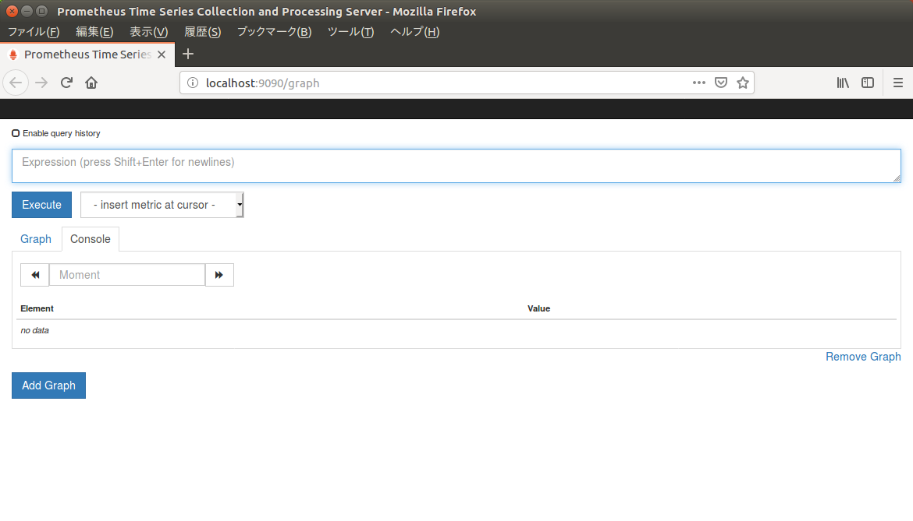

1. 「Alerts」を選択

   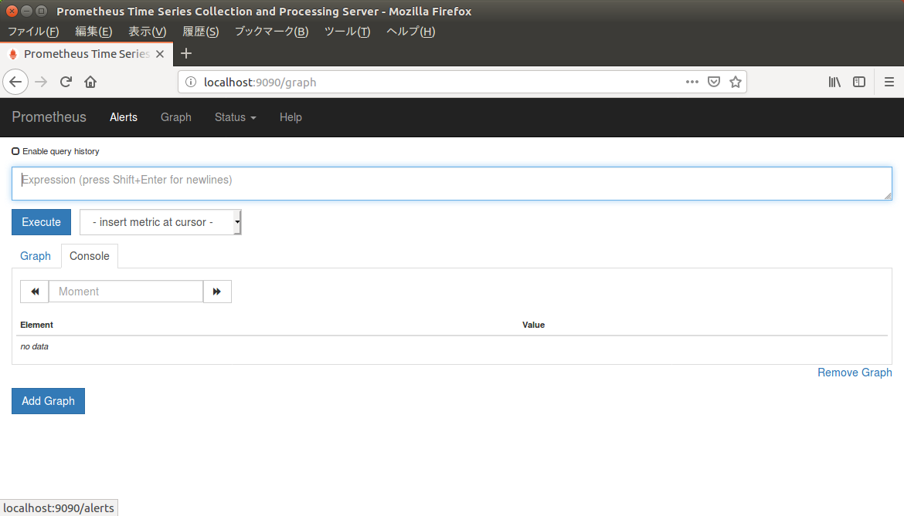

1. すべてのアラートが「0 active」と表示されることを確認

    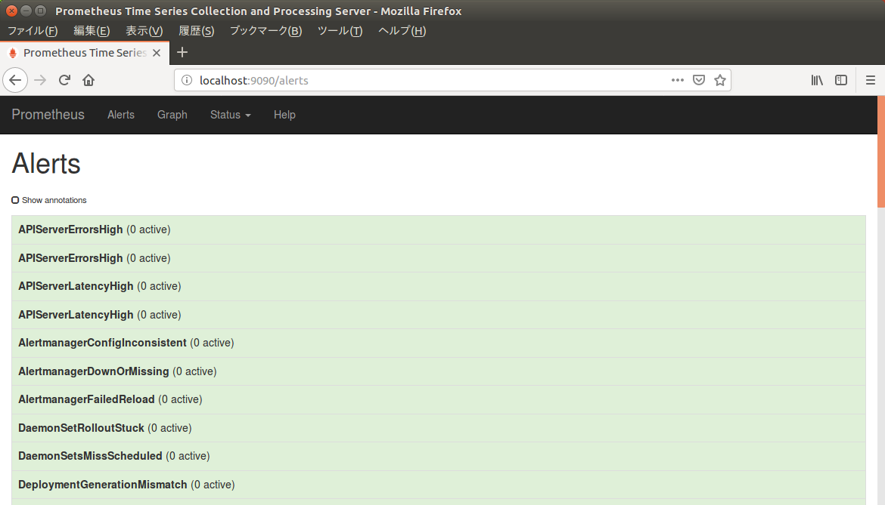

1. メニューから「Status」「Targets」をクリック

    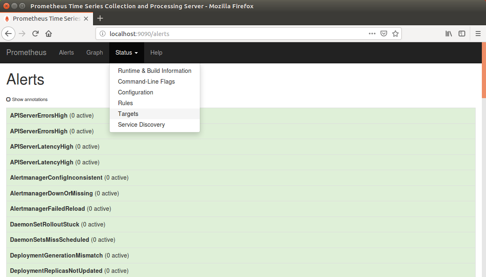

1. すべての「State」が「UP」になっていることを確認

    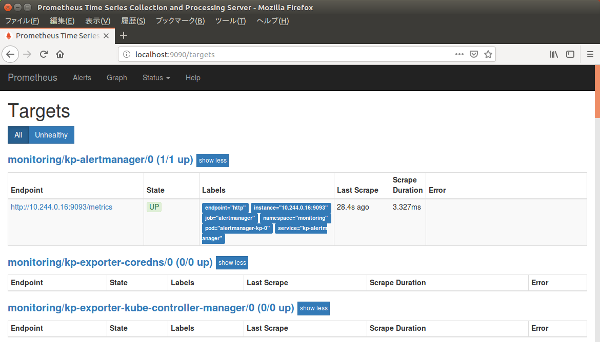

1. ブラウザを終了

1. port-forwardingを閉じる


## grafanaのData Sources追加

1. コマンドの作成

    ```
    $ echo 'kubectl --namespace monitoring port-forward $(kubectl get pod --namespace monitoring -l app=kp-grafana -o template --template "{{(index .items 0).metadata.name}}") 3000:3000'
    ```

1. 別ターミナルでgrafanaのポートフォワーディングを開始

    ```
    $ kubectl --namespace monitoring port-forward $(kubectl get pod --namespace monitoring -l app=kp-grafana -o template --template "{{(index .items 0).metadata.name}}") 3000:3000
    ```

    - 実行結果（例）

      ```
      Forwarding from 127.0.0.1:3000 -> 3000
      Forwarding from [::1]:3000 -> 3000
      ```

1. ブラウザでgrafanaにアクセス

    ```
    $ xdg-open http://localhost:3000
    ```

1. grafanaのログイン画面が表示されたことを確認

   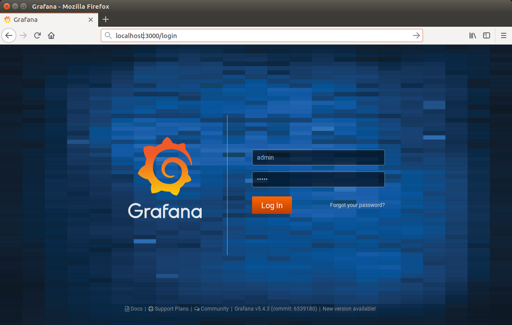

1. 「email or username」に「admin」、「password」に「admin」を入力し「Log In」をクリック

    

1. パスワードの変更画面が表示されるので、新規パスワードを入力し「Save」をクリック

    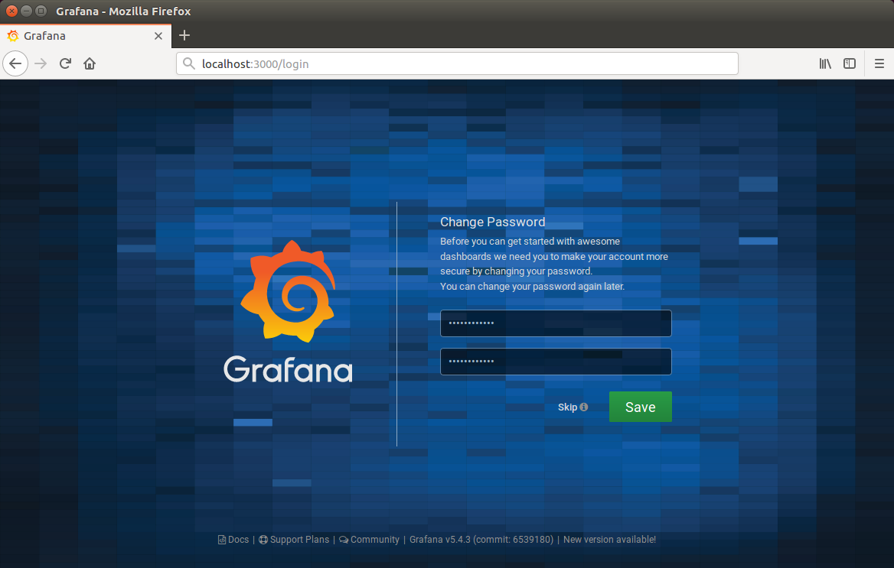

1. ホーム画面が表示されることを確認

    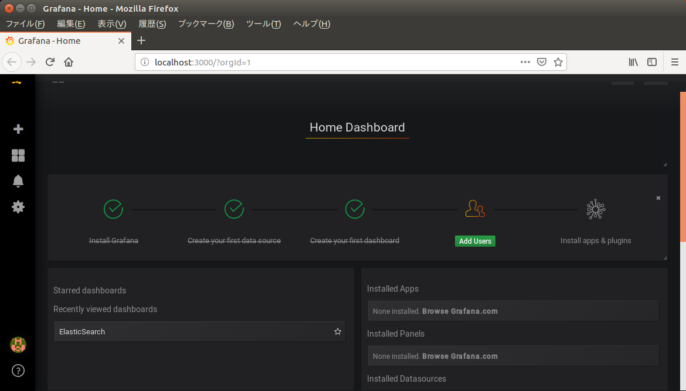

1. 「歯車」「Data Sources」をクリック

    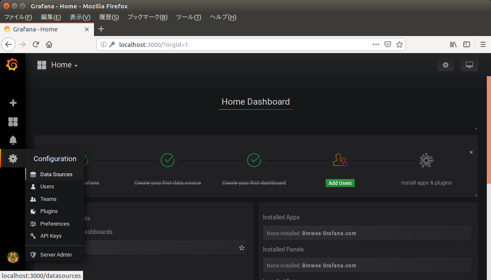

1. 「prometheus」をクリック

    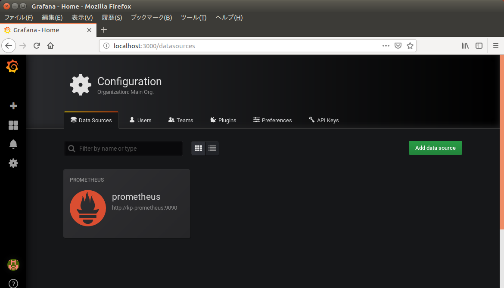

1. 「URL」のテキストボックスに「http://kp-prometheus:9090」を入力

    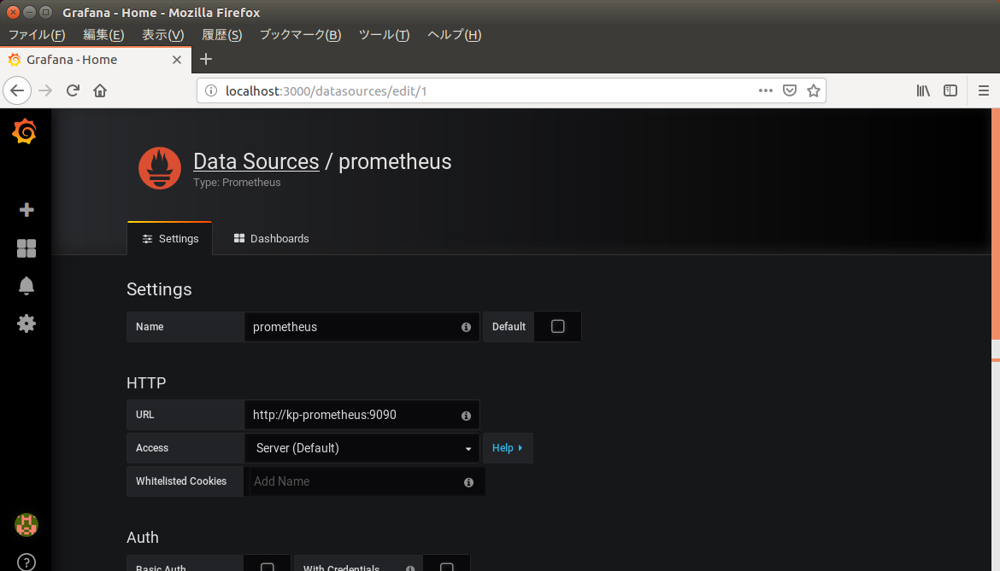

1. 最後部の「Save & Test」をクリック

    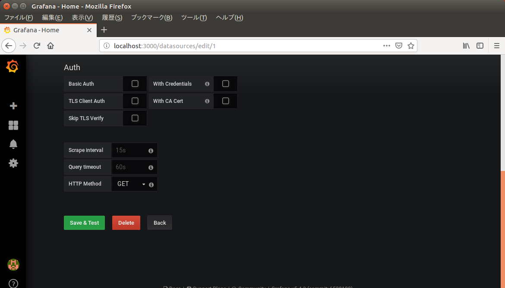

1. 「Data source is working」が表示されたことを確認

    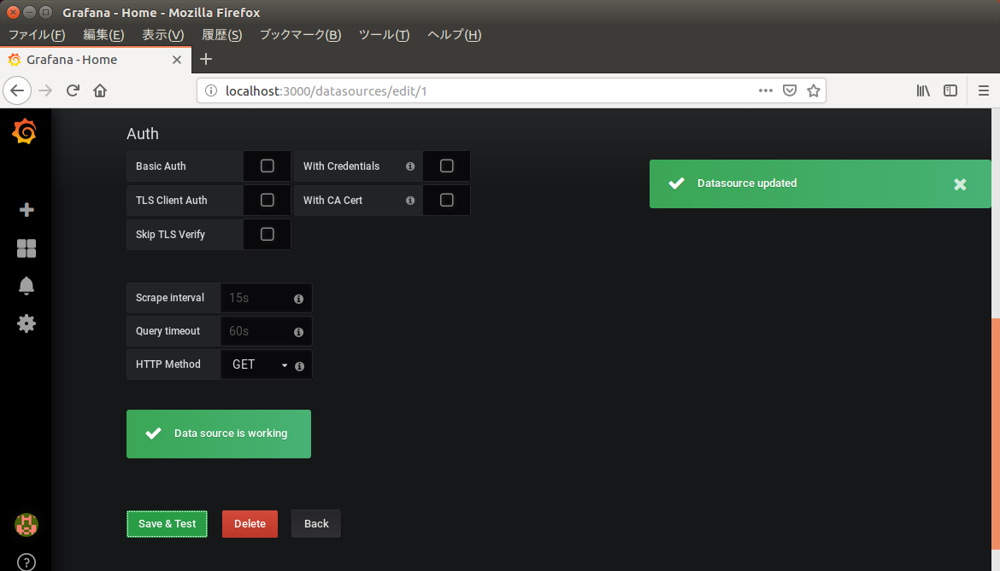

1. 「+」「Import」をクリック

    

1. 「Upload .json File」をクリック

     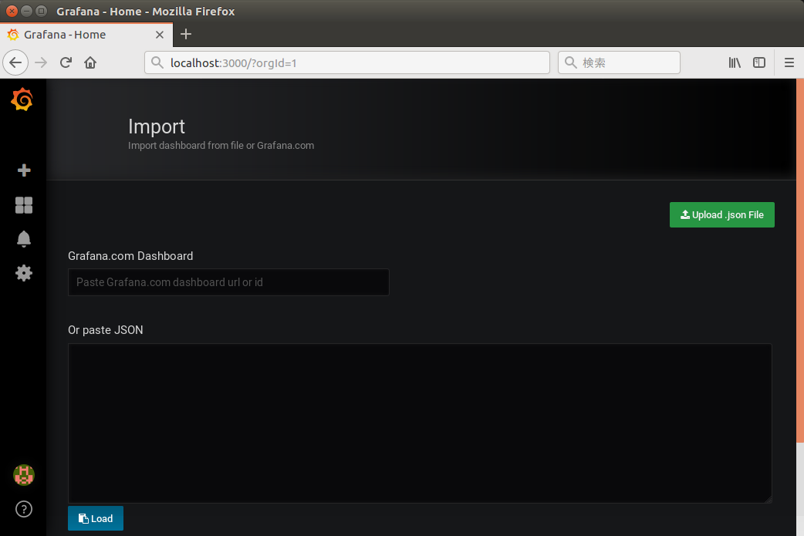

1. 「monitoring/dashboard_persistent_volumes.json」を選択し「開く」をクリック

    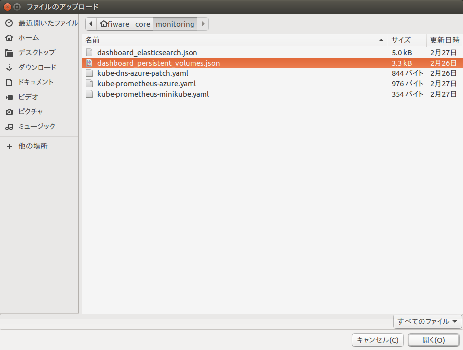

1. 「Import」をクリック

    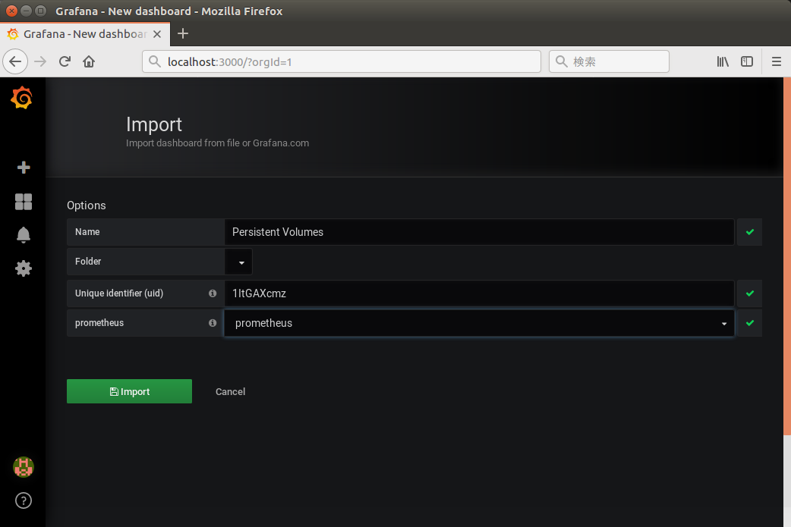

1. Persist Volumeのダッシュボード画面が表示されることを確認

    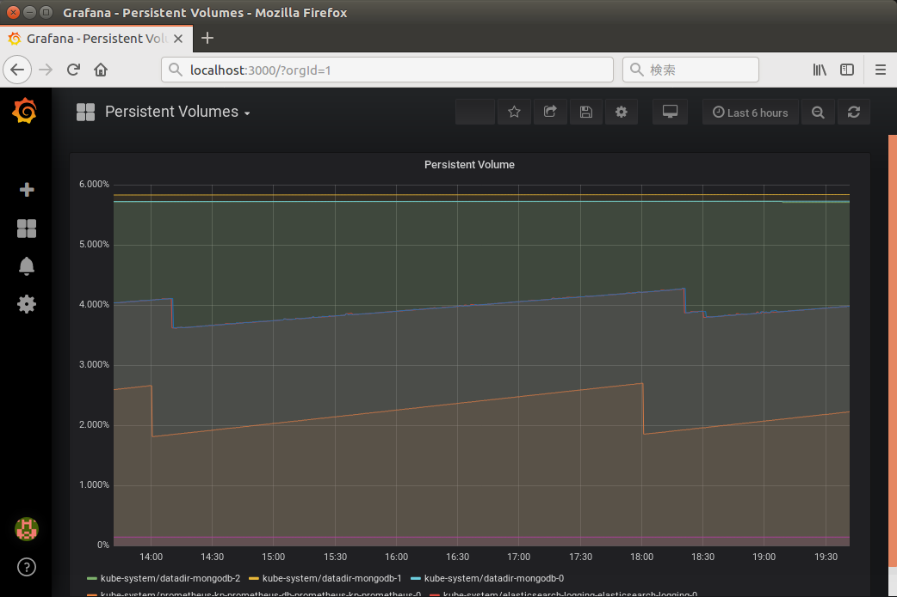

1. ブラウザを終了

1. port-forwardingを閉じる


## Elasticsearchの設定

1. elasticsearch-azure-serviceの作成

    ```
    $ kubectl apply -f logging/elasticsearch-azure-service.yaml
    ```

    - 実行結果（例）

      ```
      service/elasticsearch-logging created
      ```

1. elasticsearch-azure-deploymentの作成

    ```
    $ kubectl apply -f logging/elasticsearch-azure-deployment.yaml
    ```

    - 実行結果（例）

      ```
      serviceaccount/elasticsearch-logging created
      clusterrole.rbac.authorization.k8s.io/elasticsearch-logging created
      clusterrolebinding.rbac.authorization.k8s.io/elasticsearch-logging created
      statefulset.apps/elasticsearch-logging created
      ```

1. elasticsearch-loggingのstatefulsets状態確認

    ```
    $ kubectl get statefulsets --namespace monitoring -l k8s-app=elasticsearch-logging
    ```

    - 実行結果（例）

      ```
      NAME                    DESIRED   CURRENT   AGE
      elasticsearch-logging   2         2         2m24s
      ```

1. elasticsearch-loggingのpods状態確認

    ```
    $ kubectl get pods --namespace monitoring -l k8s-app=elasticsearch-logging
    ```

    - 実行結果（例）

      ```
      NAME                      READY   STATUS    RESTARTS   AGE
      elasticsearch-logging-0   1/1     Running   0          4m46s
      elasticsearch-logging-1   1/1     Running   0          2m26s
      ```

1. elasticsearch-loggingのservices状態確認

    ```
    $ kubectl get services --namespace monitoring -l k8s-app=elasticsearch-logging
    ```

    - 実行結果（例）

      ```
      NAME                    TYPE        CLUSTER-IP     EXTERNAL-IP   PORT(S)    AGE
      elasticsearch-logging   ClusterIP   10.0.148.167   <none>        9200/TCP   7m45s
      ```

1. elastic-searchのpersistentvolumeclaims状態確認

    ```
    $ kubectl get persistentvolumeclaims -n monitoring -l k8s-app=elasticsearch-logging
    ```

    - 実行結果（例）

      ```
      NAME                                            STATUS   VOLUME                                     CAPACITY   ACCESS MODES   STORAGECLASS      AGE
      elasticsearch-logging-elasticsearch-logging-0   Bound    pvc-8e751ff8-38c0-11e9-a6d0-3eb5d27c5279   64Gi       RWO            managed-premium   7m55s
      elasticsearch-logging-elasticsearch-logging-1   Bound    pvc-e1b53352-38c0-11e9-a6d0-3eb5d27c5279   64Gi       RWO            managed-premium   5m35s
      ```

1. elasticsearch-loggingの接続確認

    ```
    $ kubectl exec -it elasticsearch-logging-0 --namespace monitoring -- curl -H "Content-Type: application/json" -X PUT http://elasticsearch-logging:9200/_cluster/settings -d '{"transient": {"cluster.routing.allocation.enable":"all"}}'
    ```

    - 実行結果（例）

      ```
      {"acknowledged":true,"persistent":{},"transient":{"cluster":{"routing":{"allocation":{"enable":"all"}}}}}
      ```

## fluentdの設定

1. fluentd-es-configmapの作成

    ```
    $ kubectl apply -f logging/fluentd-es-configmap.yaml
    ```

    - 実行結果（例）

      ```
      configmap/fluentd-es-config-v0.2.0 created
      ```

1. fluentd-es-dsの作成

    ```
    $ kubectl apply -f logging/fluentd-es-ds.yaml
    ```

    - 実行結果（例）

      ```
      serviceaccount/fluentd-es created
      clusterrole.rbac.authorization.k8s.io/fluentd-es created
      clusterrolebinding.rbac.authorization.k8s.io/fluentd-es created
      daemonset.apps/fluentd-es-v2.4.0 created
      ```

1. fluentd-esのdaemonsets状態確認

    ```
    $ kubectl get daemonsets --namespace monitoring -l k8s-app=fluentd-es
    ```

    - 実行結果（例）

      ```
      NAME                DESIRED   CURRENT   READY   UP-TO-DATE   AVAILABLE   NODE SELECTOR   AGE
      fluentd-es-v2.4.0   4         4         4       4            4           <none>          113s
      ```

1. fluentd-esのpods状態確認

    ```
    $ kubectl get pods --namespace monitoring -l k8s-app=fluentd-es
    ```

    - 実行結果（例）

      ```
      NAME                      READY   STATUS    RESTARTS   AGE
      fluentd-es-v2.4.0-26fhm   1/1     Running   0          2m30s
      fluentd-es-v2.4.0-5ftbp   1/1     Running   0          2m30s
      fluentd-es-v2.4.0-cvrn4   1/1     Running   0          2m30s
      fluentd-es-v2.4.0-pv5nh   1/1     Running   0          2m30s
      ```

## Kibanaの設定

1. kibana-serviceの作成

    ```
    $ kubectl apply -f logging/kibana-service.yaml
    ```

    - 実行結果（例）

      ```
      service/kibana-logging created
      ```

1. kibana-deploymentの作成

    ```
    $ kubectl apply -f logging/kibana-deployment.yaml
    ```

    - 実行結果（例）

      ```
      deployment.apps/kibana-logging created
      ```

1. kibana-loggingのpods状態確認

    ```
    $ kubectl get pods --namespace monitoring -l k8s-app=kibana-logging
    ```

    - 実行結果（例）

      ```
      NAME                              READY   STATUS    RESTARTS   AGE
      kibana-logging-76ff7dbb49-mbzqd   1/1     Running   0          102s
      ```

## curatorの設定

1. curator-configmapの作成

    ```
    $ kubectl apply -f logging/curator-configmap.yaml
    ```

    - 実行結果（例）

      ```
      configmap/curator-config created
      ```

1. curator-cronjobの作成

    ```
    $ kubectl apply -f logging/curator-cronjob.yaml
    ```

    - 実行結果（例）

      ```
      cronjob.batch/elasticsearch-curator created
      ```

1. elasticsearch-curatorのcronjobs状態確認

    ```
    $ kubectl get cronjobs --namespace monitoring -l k8s-app=elasticsearch-curator
    ```

    - 実行結果（例）

      ```
      NAME                    SCHEDULE     SUSPEND   ACTIVE   LAST SCHEDULE   AGE
      elasticsearch-curator   0 18 * * *   False     0        <none>          2m28s
      ```


## KibanaにIndex Patternsの設定

1. コマンドの作成

    ```
    $ echo 'kubectl --namespace monitoring port-forward $(kubectl get pod -l k8s-app=kibana-logging --namespace monitoring -o template --template "{{(index .items 0).metadata.name}}") 5601:5601'
    ```

1. 別ターミナルでKibanaのポートフォワーディングを開始

    ```
    $ kubectl --namespace monitoring port-forward $(kubectl get pod -l k8s-app=kibana-logging --namespace monitoring -o template --template "{{(index .items 0).metadata.name}}") 5601:5601
    ```

    - 実行結果（例）

      ```
      Forwarding from 127.0.0.1:5601 -> 5601
      Forwarding from [::1]:5601 -> 5601
      ```

1. ブラウザでkibanaにアクセス

    ```
    $ xdg-open http://localhost:5601/
    ```

1. KibanaのWEB管理画面が表示されたことを確認

    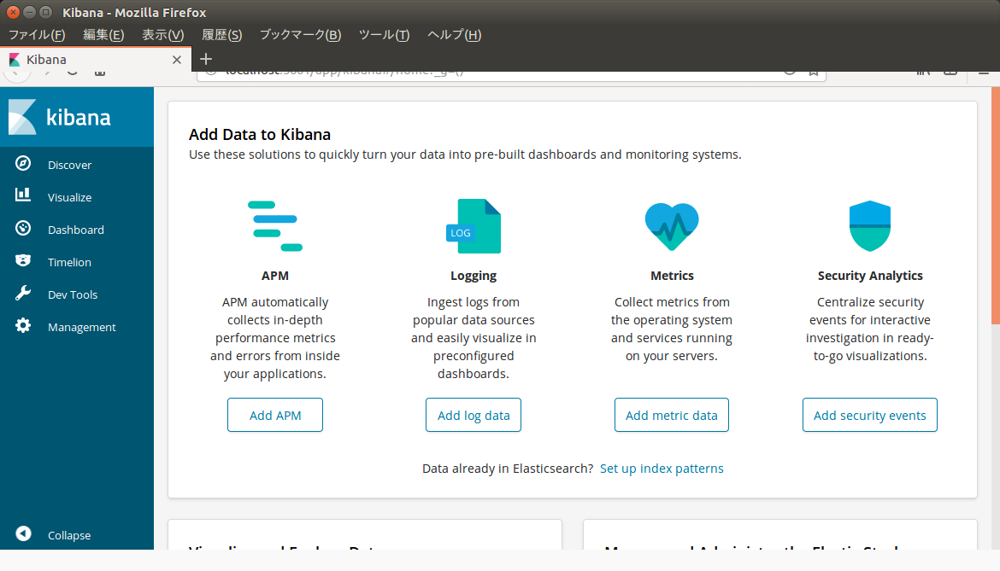

1. 「Management」をクリック

    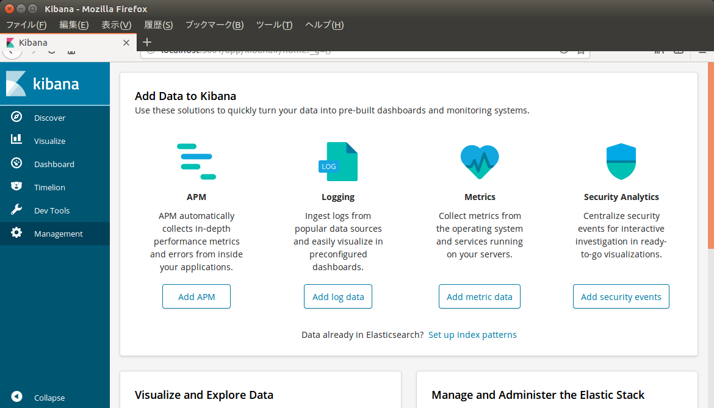

1. 「Index Patterns」をクリック

    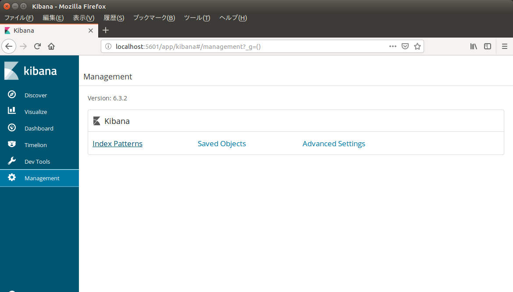

1. 「Index pattern」のテキストボックスに「logstash-*」を入力

    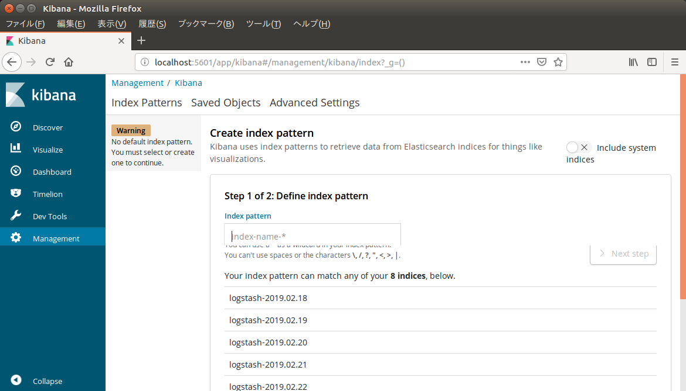

1. 「Success!」のメッセージが表示されたことを確認し「Next step」をクリック

    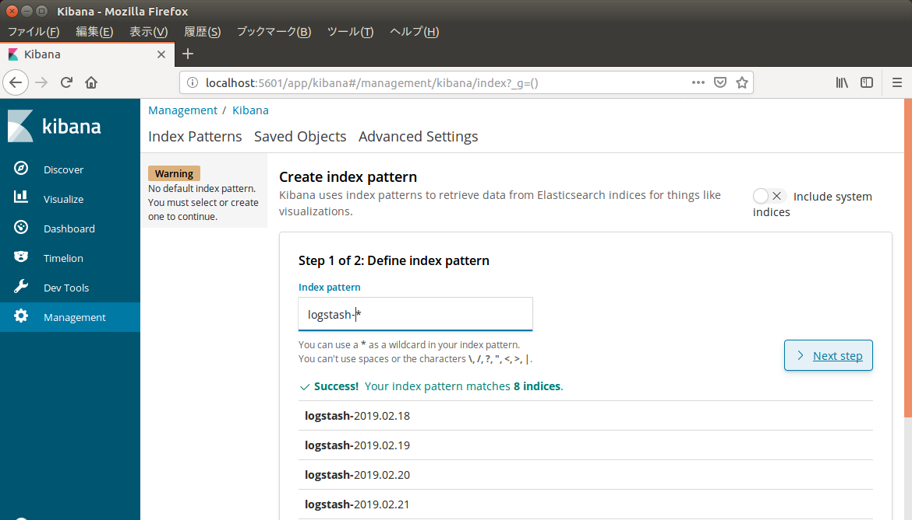

1. 「Time Filter field name」のテキストボックスで「@timestamp」を選択し「Create Index pattern」をクリック

    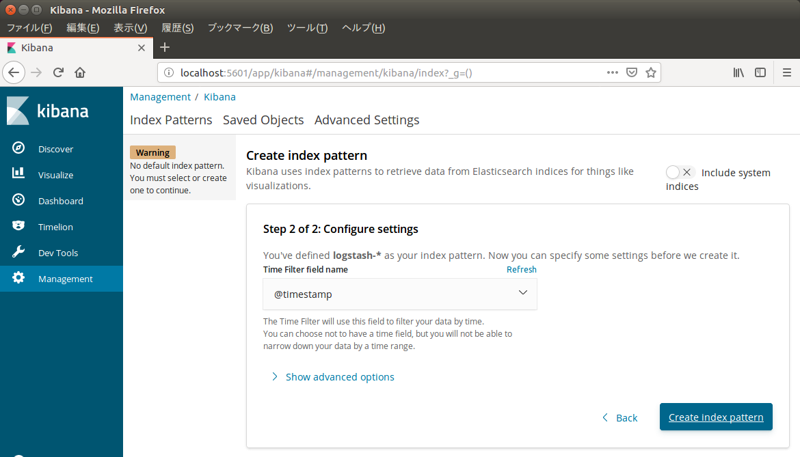

1. 「logstash-*」が作成されたことを確認

    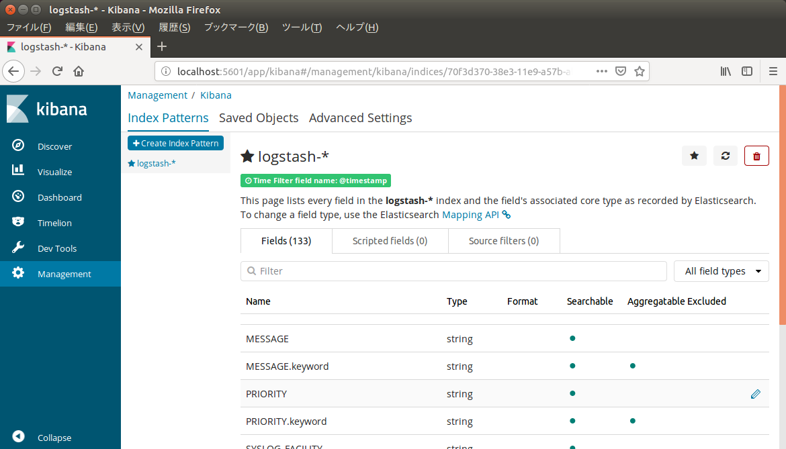

1. ブラウザを終了

1. port-forwardingを閉じる


## grafanaにelasticsearch dashboardの追加

1. コマンドの作成

    ```
    $ echo 'kubectl --namespace monitoring port-forward $(kubectl get pod --namespace monitoring -l app=kp-grafana -o template --template "{{(index .items 0).metadata.name}}") 3000:3000'
    ```

1. 別ターミナルでgrafanaのポートフォワーディングを開始

    ```
    $ kubectl --namespace monitoring port-forward $(kubectl get pod --namespace monitoring -l app=kp-grafana -o template --template "{{(index .items 0).metadata.name}}") 3000:3000
    ```

    - 実行結果（例）

      ```
      Forwarding from 127.0.0.1:3000 -> 3000
      Forwarding from [::1]:3000 -> 3000
      ```

1. ブラウザでgrafanaにアクセス

    ```
    $ xdg-open http://localhost:3000
    ```

1. grafanaのWEB管理画面が表示されたことを確認

    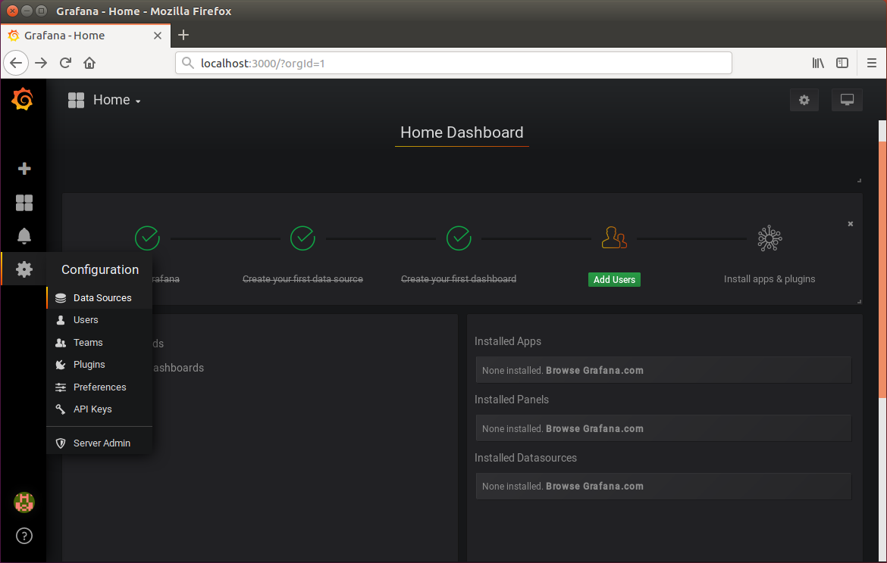

1. 「歯車」「Data Sources」をクリック

    

1. 「Add data source」をクリック

    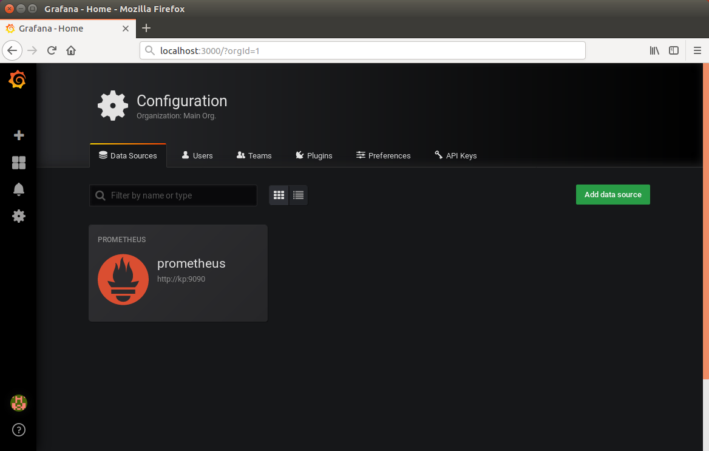

1. 「ElasticSearch」をクリック

    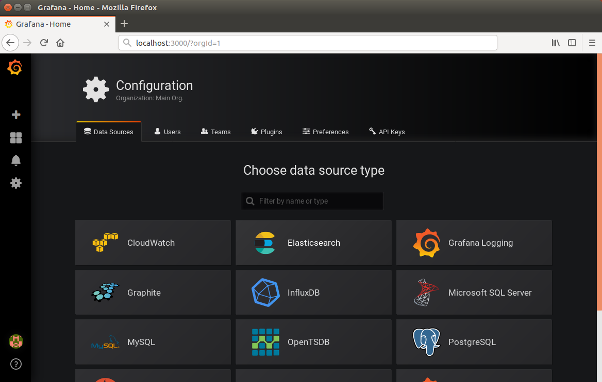

1. 下記の設定値を入力し、「Save & Test」をクリック

    Name : cygnus-fiwaredemo-deployer  
    URL : http://elasticsearch-logging:9200  
    Access : Server(Default)  
    Index name : logstash-* 
    Time field name : @timestamp  
    Version : 6.0+

    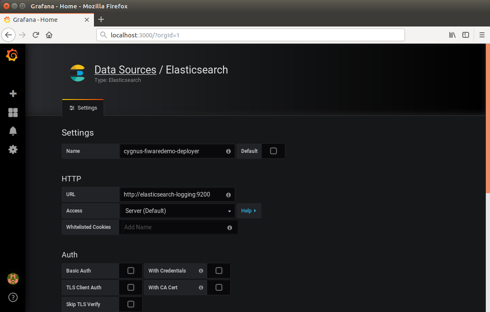

    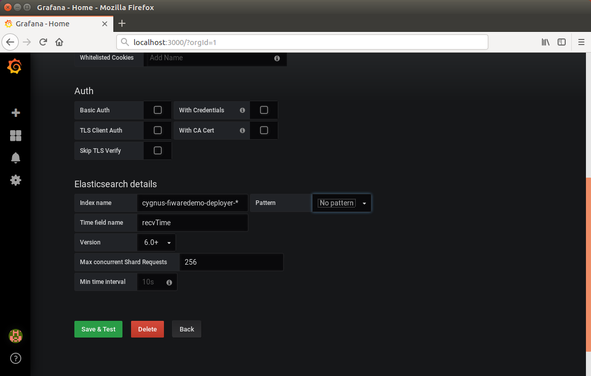

1. 「Datasource Updated」と表示されることを確認

    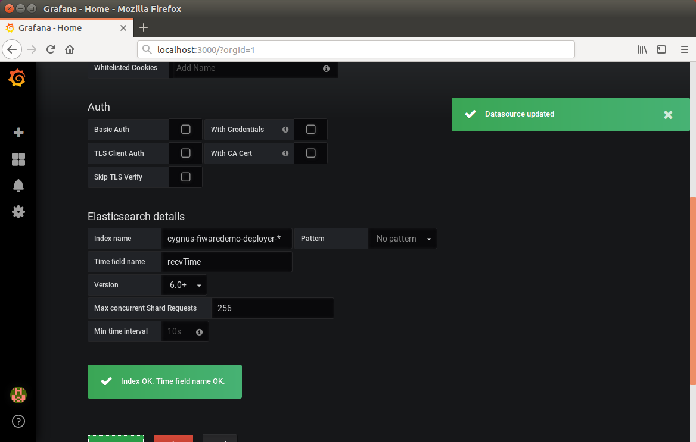

1. 「+」「Import」をクリック

    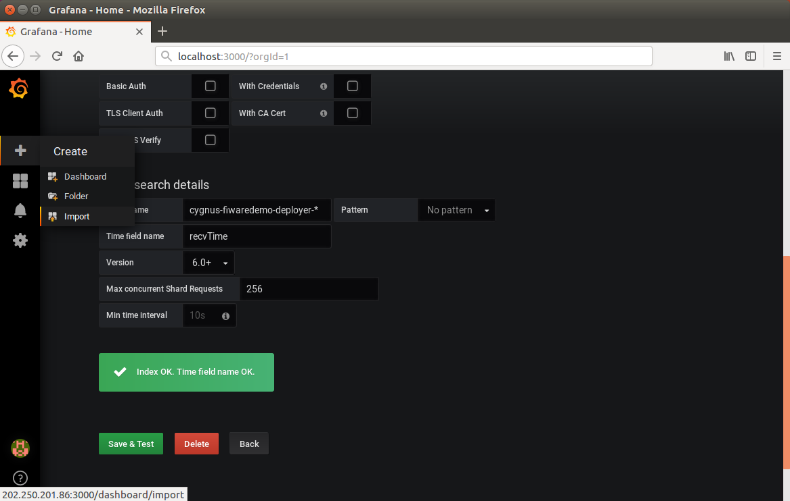

1. 「Upload .json File」をクリック

     

1. 「monitoring/dashboard_elasticsearch.json」を選択し「開く」をクリック

     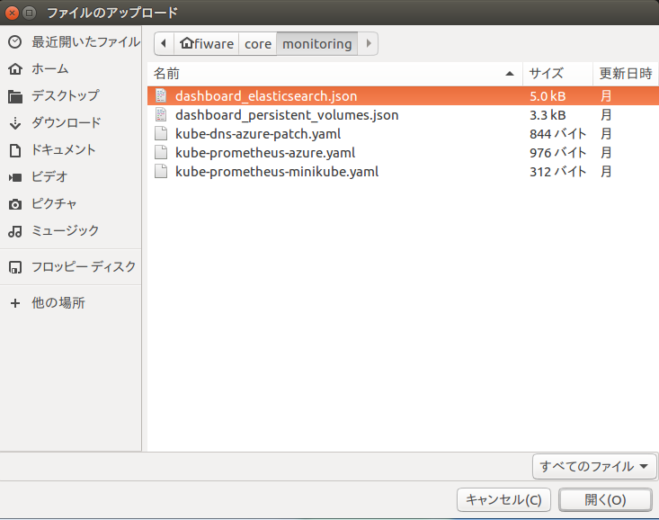

1. 「Import」をクリック

    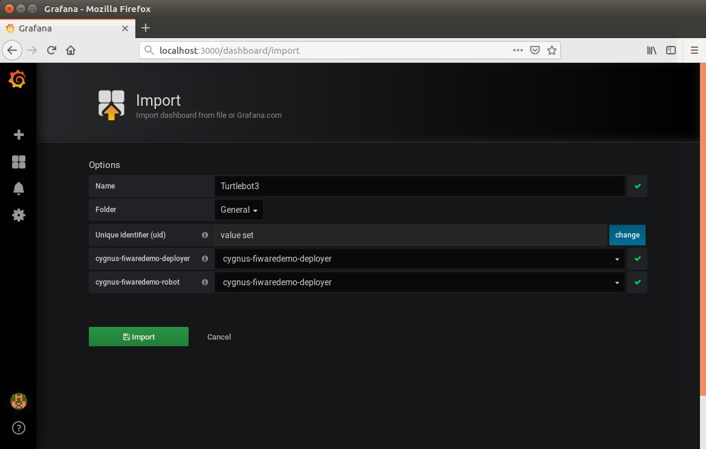

1. ElasticSeartchのダッシュボード画面が表示されることを確認

    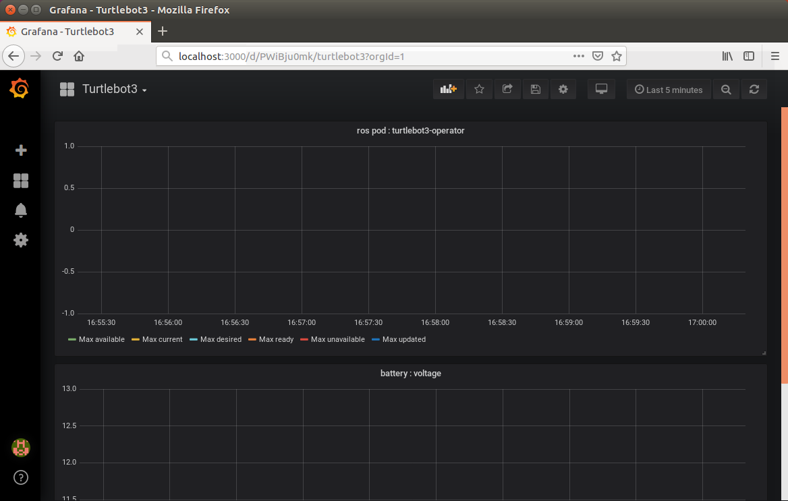

1. ブラウザを終了

1. port-forwardingを閉じる
