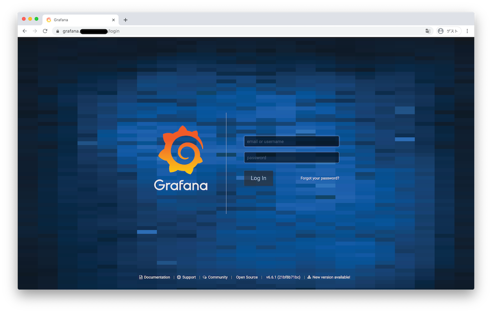
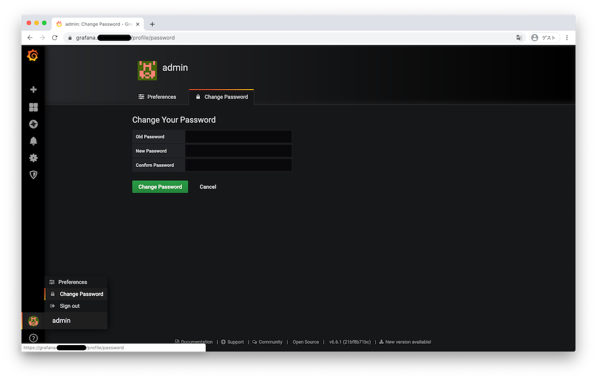
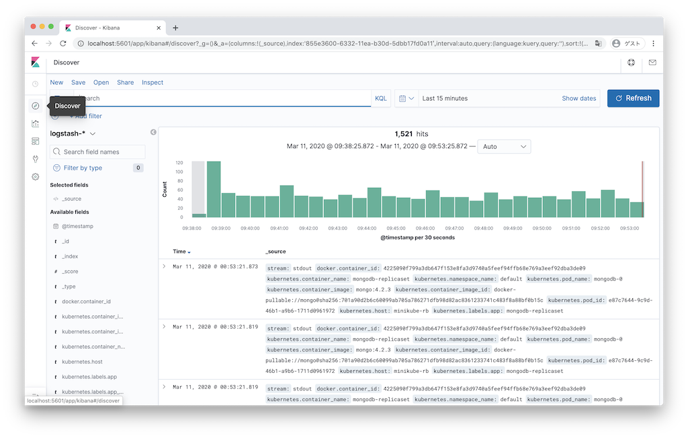

# RoboticBase Coreインストールガイド(Microsoft Azure AKS)

## 構築環境

||version|
|:--|:--|
|OS|macOS Mojave 10.14.6<br/>Ubuntu 16.04|
|pyenv|1.2.16|
|pipenv|2018.11.26|
|kubectl|1.17.3|
|helm|3.1.1|
|openssl|2.6.5|
|azure cli|2.1.0|

## 準備
### ツールのインストール
<details><summary><b>pyenv</b>と<b>pipenv</b>のインストール</summary>
<p>

#### macOS

```
$ brew install pyenv
$ echo 'export PYENV_ROOT="$HOME/.pyenv"' >> ~/.bashrc
$ echo 'export PATH="$PYENV_ROOT/bin:$PATH"' >> ~/.bashrc
$ echo 'eval "$(pyenv init -)"' >> ~/.bashrc
$ source ~/.bashrc
$ brew install pipenv
```

#### ubuntu

```
$ sudo apt install -y build-essential libffi-dev libssl-dev zlib1g-dev libbz2-dev libreadline-dev libsqlite3-dev git python3-pip
$ git clone https://github.com/pyenv/pyenv.git ~/.pyenv
$ echo 'export PYENV_ROOT="$HOME/.pyenv"' >> ~/.bashrc
$ echo 'export PATH="$PYENV_ROOT/bin:$PATH"' >> ~/.bashrc
$ echo 'eval "$(pyenv init -)"' >> ~/.bashrc
$ source ~/.bashrc
$ pip3 install pipenv
```

</p>
</details>

<details><summary><b>kubectl</b>のインストール</summary>
<p>

#### macOS

```
$ curl -LO "https://storage.googleapis.com/kubernetes-release/release/v1.17.3/bin/darwin/amd64/kubectl"
$ chmod +x ./kubectl
$ sudo mv ./kubectl /usr/local/bin/kubectl
```

#### ubuntu

```
$ curl -LO "https://storage.googleapis.com/kubernetes-release/release/v1.17.3/bin/linux/amd64/kubectl"
$ chmod +x ./kubectl
$ sudo mv ./kubectl /usr/local/bin/kubectl
```

</p>
</details>

<details><summary><b>helm</b>のインストール</summary>
<p>

#### macOS

```
$ curl -LO "https://get.helm.sh/helm-v3.1.1-darwin-amd64.tar.gz"
$ tar xvfz helm-v3.1.1-darwin-amd64.tar.gz
$ sudo mv darwin-amd64/helm /usr/local/bin/helm
```

#### ubuntu

```
$ curl -LO "https://get.helm.sh/helm-v3.1.1-linux-amd64.tar.gz"
$ tar xvfz helm-v3.1.1-linux-amd64.tar.gz
$ sudo mv linux-amd64/helm /usr/local/bin/helm
```

</p>
</details>

<details><summary><b>openssl</b>のインストール</summary>
<p>

#### macOS

```
$ brew install openssl
```

#### ubuntu

```
$ sudo apt install -y openssl
```

</p>
</details>

<details><summary><b>Azure CLI</b>のインストール</summary>
<p>

#### macOS

```
$ brew install azure-cli
```

#### ubuntu

```
$ curl -sL https://aka.ms/InstallAzureCLIDeb | sudo bash
```

</p>
</details>

### ansibleの準備
<details><summary>RoboticBase/coreをclone</summary>
<p>

```
$ git clone https://github.com/RoboticBase/core.git
$ cd core
```

</p>
</details>

<details><summary><b>ansible</b>と関連するPythonライブラリのインストール</summary>
<p>

```
$ cd ansible
$ pipenv install
```

</p>
</details>

## RoboticBase/coreのインストール
### 変数の変更
1. 次のYAMLファイルに定義されているMQTTユーザー（`iotagent`）のパスワード(**mqtt.users[?name==\`iotagent\`].password**)を変更する
    * [group\_vars/all.yml](../../ansible/group_vars/all.yml)
1. 次のYAMLファイルに定義されているドメイン名(**dns.domain**)とEmailアドレス(**dns.email**)を自身のドメインとEmailアドレスに変更する
    * [inventories/aks/group\_vars/aks.yml](../../ansible/inventories/aks/group_vars/aks.yml)
1. 次のYAMLファイルに定義されているSSHキー名(**resources.ssh\_key\_file\_path**)を自身の公開鍵のパスに変更する
    * [inventories/aks/host\_vars/azure.yml](../../ansible/inventories/aks/host_vars/azure.yml)
1. Azureに起動するworker nodeの数やVM SIZE等を変更したい場合には、次のYAMLファイルに定義されている値を変更する
    * [inventories/aks/group\_vars/aks.yml](../../ansible/inventories/aks/group_vars/aks.yml)
1. 起動する各コンテナのレプリカ数等を変更したい場合には、次のYAMLファイルに定義されている値を変更する
    * [inventories/aks/group\_vars/aks.yml](../../ansible/inventories/aks/group_vars/aks.yml)

### Azure Credentialsを生成
1. 次のシェルスクリプトを実行し、ansibleからazureを利用する最に用いるcredentialsを取得する

    ```
    $ ./tools/generate_azure_credentials.sh
    ```

### RoboticBase/coreを起動
1. pipenv shellを起動する

    ```
    $ pipenv shell
    ```
1. ansibleを用いてRoboticBase/coreをminikube上に起動する

    ```
    $ ansible-playbook -i inventories/aks --extra-vars="ansible_python_interpreter=$(which python)" aks.yml
    ```

### grafanaの設定
1. ブラウザでgrafana (https://grafana.{{ your domain }})にアクセスする
    
1. **email or username**に"admin"、**password**に"prom-operator"を入力し**Log In**する
    
1. 左下の**Preferences**より**Change Password**を選択し、adminのパスワードを変更する
    
1. ホーム画面より、minikubeの各種リソースを監視するダッシュボードがインストールされていることを確認する
    

### kibanaの設定
1. kibanaのユーザー名とパスワードを確認する

    ```
    $ ./tools/show_kibana_credentials.py
    ```
1. ブラウザでkibana (https://kibana.{{ your domain }})にアクセスする
    
1. kibanaのユーザー名とパスワードを入力して**ログイン**する
    
1. **Explore on my own**をクリックしてホーム画面を表示する
    
1. **Management**をクリックして管理画面を表示する
    
1. **Index Patterns**をクリックする
    
1. **Create Index Patterns**をクリックする
    
1. **Index pattern**に"logstash-\*"と入力し、**Next Step**をクリックする
    
1. **Time Filter field name**として"@timestamp"を選択し、**Create Index pattern**をクリックする
    
1. Indexが作成される
    
1. **Discover**をクリックし、Podのログが収集されていることを確認する
    
